# TypeScript — From Zero to Interview-Ready

> **Audience:** JavaScript / Node.js developers learning TypeScript from scratch.
> **Style:** Session-based, paragraph explanations, with diagrams, examples, common mistakes, and interview prep.

---

## Table of Contents

| Session                   | Topic                             | New Topics Added                                                                                |
| ------------------------- | --------------------------------- | ----------------------------------------------------------------------------------------------- |
| [Session 1](#session-1)   | Introduction & Setup              |                                                                                                 |
| [Session 2](#session-2)   | Basic Types                       | + Type Assertions                                                                               |
| [Session 3](#session-3)   | Type Inference & Annotations      |                                                                                                 |
| [Session 4](#session-4)   | Objects & Interfaces              |                                                                                                 |
| [Session 5](#session-5)   | Advanced Types                    | + Enums, + Type Compatibility, + Branded Types                                                  |
| [Session 6](#session-6)   | Functions Deep Dive               |                                                                                                 |
| [Session 7](#session-7)   | Generics                          |                                                                                                 |
| [Session 8](#session-8)   | Classes & OOP                     | + Decorators                                                                                    |
| [Session 9](#session-9)   | Advanced TypeScript               | + Template Literal Types, + satisfies, + Recursive Types, + infer deep dive, + @ts-expect-error |
| [Session 10](#session-10) | Modules & Project Structure       | + Declaration Files (.d.ts)                                                                     |
| [Session 11](#session-11) | TypeScript with Node.js / Express |                                                                                                 |

---

---

<a id="session-1"></a>

# SESSION 1 - Introduction & Setup

---

## What is TypeScript?

> [↑ Back to TOC](#table-of-contents)

### 1. Concept Explanation

TypeScript is a programming language built **on top of JavaScript**. It is called a "superset" of JavaScript, which means every valid JavaScript program is also a valid TypeScript program. However, TypeScript adds one crucial thing that JavaScript does not have: **static types**.

In JavaScript, you can write `let x = 5` and later do `x = "hello"` and JavaScript will not complain. TypeScript, on the other hand, will say: "You said `x` was a number, you cannot now assign a string to it." This checking happens **before** your code even runs, during the compilation step.

TypeScript is developed and maintained by **Microsoft**. It compiles (transpiles) down to plain JavaScript, so Node.js never sees TypeScript — only the compiled `.js` output.

---

### 2. Why TypeScript Exists

JavaScript was originally designed for small browser scripts. As applications grew larger, JavaScript began showing weaknesses. There was no way to enforce what type of data a function expected. A function expecting a number could silently receive `undefined` and crash at runtime. TypeScript was created to bring **compile-time safety** to JavaScript — bugs that would take hours to debug at runtime get caught the moment you write them.

---

### 3. Visual Representation

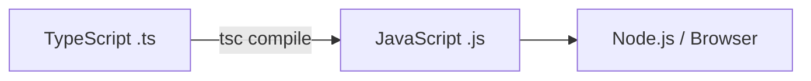

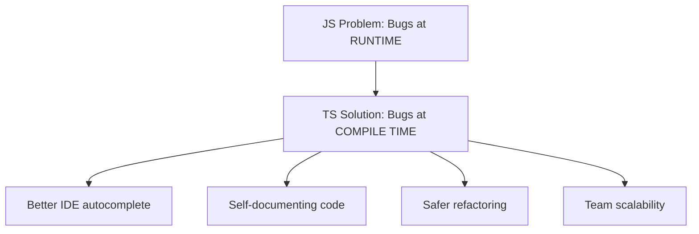

---

### 4. JavaScript vs TypeScript Side by Side

```javascript
// JavaScript — No error shown, crashes at runtime
function getUserName(user) {
    return user.name.toUpperCase(); // crashes if user is undefined
}
getUserName(); // No warning from JS
```

```typescript
// TypeScript — Caught immediately in editor
interface User {
    name: string;
}

function getUserName(user: User): string {
    return user.name.toUpperCase(); // safe — name is always a string
}

getUserName(); // ERROR: Argument of type undefined is not assignable
```

---

### 5. Common Mistakes

One of the most common beginner mistakes is thinking TypeScript provides runtime type safety. It does not. TypeScript is a **compile-time** tool only. Once compiled to JavaScript, all type information is erased. If you receive data from an external API, TypeScript cannot verify it at runtime — you still need to validate it yourself (e.g., with `zod`).

Another mistake: thinking TypeScript is a completely different language. It is not. You can migrate a JS project to TypeScript file by file.

---

### 6. Interview Perspective

Interviewers often ask: _"What is the difference between TypeScript and JavaScript?"_

Key answer: TypeScript adds **static typing** and is a **superset** of JavaScript. It compiles to JavaScript and catches type errors at compile time, not runtime. It also adds interfaces, enums, generics, and access modifiers.

Another common question: _"Is TypeScript better than JavaScript?"_ TypeScript is better for large codebases and teams. JavaScript is fine for small scripts. TypeScript adds a build step and a learning curve.

---

## Installing TypeScript and tsconfig Basics

> [↑ Back to TOC](#table-of-contents)

### 1. Setup Steps

```bash
# Initialize a new Node.js project
npm init -y

# Install TypeScript and dev tools
npm install -D typescript ts-node @types/node

# Generate tsconfig.json
npx tsc --init

# Compile TypeScript to JavaScript
npx tsc

# Run a TypeScript file directly (dev mode)
npx ts-node src/index.ts
```

---

### 2. Understanding tsconfig.json

The `tsconfig.json` file controls how TypeScript compiles your code.

```json
{
    "compilerOptions": {
        "target": "ES2020",
        "module": "commonjs",
        "strict": true,
        "outDir": "./dist",
        "rootDir": "./src",
        "esModuleInterop": true,
        "skipLibCheck": true
    },
    "include": ["src/**/*"],
    "exclude": ["node_modules", "dist"]
}
```

| Option            | What it does                                    |
| ----------------- | ----------------------------------------------- |
| `target`          | Which JS version to compile to                  |
| `module`          | `commonjs` for Node.js, `es2020` for browsers   |
| `strict`          | Enables ALL strict checks — always turn on      |
| `outDir`          | Where compiled `.js` files go                   |
| `rootDir`         | Where your `.ts` source files are               |
| `esModuleInterop` | Allows `import x from 'x'` for CommonJS modules |

---

### 3. What `strict: true` Enables

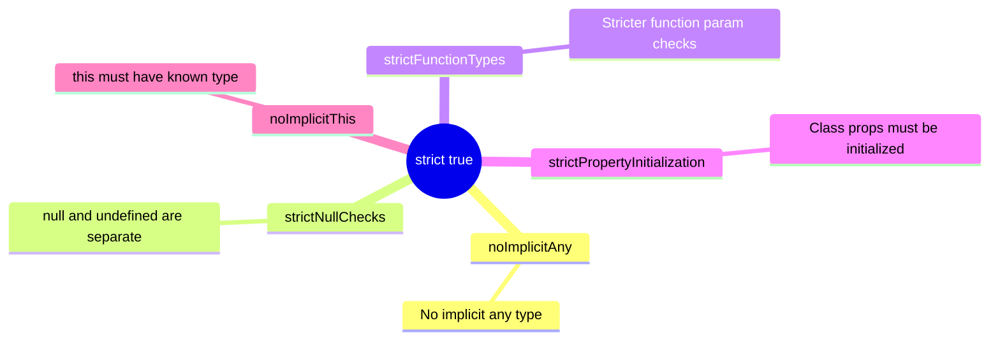

---

### 4. Common Mistakes

Beginners often skip `"strict": true` because it raises many errors initially. This is wrong. Always enable strict mode from the start. The errors it raises are real problems in your code, not noise.

---

### 5. Interview Perspective

Interviewers ask: _"What is tsconfig.json and what are the important options?"_ Mention `target`, `module`, `strict`, `outDir`, `rootDir`, and `esModuleInterop`. Explain WHY each matters. Being able to explain `strict: true` and its sub-flags shows depth of knowledge.

---

### Session 1 Recap

- TypeScript is a statically typed superset of JavaScript that compiles to JS
- It catches bugs at compile time, not runtime
- `tsc` compiles, `ts-node` runs TS directly in development
- `tsconfig.json` controls compiler behavior; `strict: true` should always be enabled
- TypeScript does NOT provide runtime type safety

---

### Conceptual Questions

1. If TypeScript compiles to JavaScript, what is the point of the types? Why don't they exist at runtime?
2. You have a JavaScript project with 50 files. How would you gradually migrate it to TypeScript?

### Interview Questions

1. _"What is the difference between TypeScript and JavaScript? Why would you choose TypeScript for a Node.js project?"_
2. _"What does `strict: true` in tsconfig.json enable? Why is it important?"_

---

[↑ Back to TOC](#table-of-contents)

<a id="session-2"></a>

# SESSION 2 - Basic Types

---

## number, string, boolean

> [↑ Back to TOC](#table-of-contents)

### 1. Concept Explanation

In JavaScript, you never declare what type a variable holds. In TypeScript, you can declare the type explicitly using a **type annotation** — the `: type` syntax after a variable or parameter name.

The three most fundamental types mirror JavaScript primitives: `number` covers all numeric values (integers, floats), `string` covers all text, and `boolean` covers `true` and `false`.

---

### 2. Why TypeScript Needs This

In JavaScript, nothing stops a caller from passing `"fifty thousand"` to a `calculateTax(salary)` function expecting a number. The function would silently produce `NaN`. TypeScript forces callers to pass the correct type, turning a potential runtime mystery into an obvious compile-time error.

---

### 3. Visual Representation

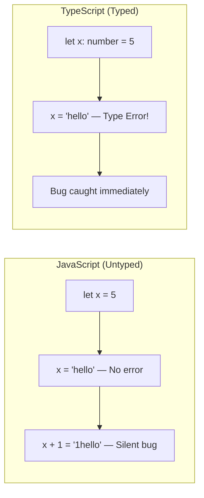

---

### 4. Code Examples

```typescript
// Basic annotations
let age: number = 25;
let salary: number = 75000.5; // floats are also 'number'

let firstName: string = "Alice";
let greeting: string = `Hello, ${firstName}!`;

let isActive: boolean = true;
let hasPermission: boolean = false;

// Typed function — parameters MUST be annotated
function calculateTax(salary: number, taxRate: number): number {
    return salary * taxRate;
}

calculateTax(50000, 0.2); // OK
// calculateTax("50000", 0.2);  // ERROR: string not assignable to number

// Return type mismatch is also caught
function getBrokenName(first: string, last: string): string {
    return 42; // ERROR: number not assignable to string
}
```

---

### 5. Common Mistakes

Always use lowercase: `number`, `string`, `boolean`. The uppercase versions (`Number`, `String`, `Boolean`) are JavaScript wrapper objects, not primitive types. TypeScript specifically warns against using them.

---

---

## null, undefined, void, never, any, unknown

> [↑ Back to TOC](#table-of-contents)

### 1. Concept Explanation

These are the "special" types in TypeScript. Each represents a different situation where a value is absent, unknown, or impossible.

- **`null`** — value is intentionally absent. "There is no user here."
- **`undefined`** — value has not been assigned yet.
- **`void`** — return type for functions that return nothing.
- **`never`** — functions that never complete (always throw or run forever).
- **`any`** — turns off type checking entirely. An escape hatch — use sparingly.
- **`unknown`** — type-safe alternative to `any`. Forces you to check the type before using the value.

---

### 2. Why TypeScript Needs This

JavaScript treats `null` and `undefined` as almost the same. TypeScript with `strictNullChecks: true` separates them completely — a `string` variable cannot hold `null` unless you explicitly allow it with `string | null`. This prevents entire categories of "Cannot read property of null" crashes.

The distinction between `any` and `unknown` is one of the most important TypeScript concepts. `any` says "I trust this, don't check it." `unknown` says "I don't know what this is — check it before using it."

---

### 3. Visual Representation

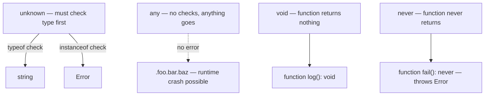

---

### 4. Code Examples

```typescript
// void — returns nothing
function logMessage(msg: string): void {
    console.log(msg);
}

// never — always throws, never returns normally
function throwError(message: string): never {
    throw new Error(message);
}

// never — exhaustive switch (very useful in interviews)
function handleState(state: "open" | "closed") {
    if (state === "open") {
        /* ... */
    } else if (state === "closed") {
        /* ... */
    } else {
        // If you add a new state and forget to handle it, TypeScript errors here
        const exhaustiveCheck: never = state;
    }
}

// any — escape hatch (avoid)
let data: any = fetchSomething();
data.foo.bar.baz; // No TypeScript error — but could crash at runtime

// unknown — safe alternative
let input: unknown = getExternalInput();
// input.toUpperCase(); // ERROR: cannot call methods on unknown

// MUST narrow the type first
if (typeof input === "string") {
    input.toUpperCase(); // OK — TypeScript knows it's a string here
}

// null and undefined with strictNullChecks
let name: string = "Alice";
// name = null; // ERROR in strict mode

let maybeName: string | null = "Alice";
maybeName = null; // OK — explicitly allowed

function greet(name: string | null): string {
    if (name === null) return "Hello, Guest!";
    return `Hello, ${name}!`;
}
```

---

### 5. Common Mistakes

The most dangerous mistake is using `any` everywhere when you don't know what type something is. The correct choice is `unknown`. With `any`, TypeScript gives up. With `unknown`, it forces you to do a type check first, keeping your code safe.

---

### 6. Interview Perspective

You will almost certainly be asked: _"What is the difference between `any` and `unknown`?"_

Answer: Both accept any value, but `unknown` is type-safe because you cannot use the value directly without first narrowing its type. `any` bypasses all type checking — it is like opting out of TypeScript entirely.

Also common: _"What is the `never` type and when would you use it?"_ Answer: `never` represents a value that never exists. It is used for functions that always throw, and for exhaustive checks in switch/if-else chains to guarantee all cases are handled.

---

---

## Arrays and Tuples

> [↑ Back to TOC](#table-of-contents)

### 1. Concept Explanation

A typed **array** in TypeScript declares what type of elements it can hold. TypeScript ensures you never accidentally push a wrong type into it.

A **tuple** is a fixed-length array where each position has a specific, known type. Unlike arrays where all elements share one type, a tuple's types are position-specific.

---

### 2. Code Examples

```typescript
// Typed arrays
let scores: number[] = [95, 87, 92];
scores.push(88); // OK
// scores.push("A");  // ERROR: string not assignable to number[]

// Generic syntax (same result)
let names: Array<string> = ["Alice", "Bob", "Charlie"];

// Array of objects
interface Product {
    id: number;
    name: string;
    price: number;
}
let products: Product[] = [{ id: 1, name: "Laptop", price: 999 }];
products.map((p) => p.price * 1.1); // TypeScript knows p has .price

// Tuples — fixed length, position-specific types
let person: [string, number] = ["Alice", 30];
let personName = person[0]; // TypeScript knows: string
let personAge = person[1]; // TypeScript knows: number

// Named tuple elements (more readable)
let coordinate: [x: number, y: number, z: number] = [10, 20, 30];

// Readonly array — prevents mutation
const config: readonly string[] = ["dev", "prod"];
// config.push("test"); // ERROR: push does not exist on readonly string[]
```

---

### 3. Common Mistakes

A common mistake is using tuples when an object (interface) would be more readable. The tuple `[string, number, boolean]` is harder to understand than `{ name: string; age: number; active: boolean }`. Use tuples when position order is naturally meaningful — like `[x, y]` coordinates or a `[value, error]` result pair.

---

### 4. Interview Perspective

_"What is the difference between an array and a tuple in TypeScript?"_

Key distinctions:

- Array: **variable length**, all elements share **one type** (`number[]`)
- Tuple: **fixed length**, each position can have a **different type** (`[string, number]`)

---

## Type Assertions

> [↑ Back to TOC](#table-of-contents)

### 1. Concept Explanation

TypeScript infers types aggressively, but sometimes you know more about a value's type than the compiler does. **Type assertions** let you override the compiler's inferred type. The most common form is the `as` keyword: `value as TargetType`. An older angle-bracket syntax (`<TargetType>value`) also exists but is not allowed inside `.tsx` files.

Type assertions do **not** perform runtime type coercion. They are purely a compile-time instruction — "trust me, this value is of this type." If you're wrong, you'll get a runtime error, not a compile-time one.

---

### 2. Why It Exists

When working with DOM APIs, JSON parsed data, or third-party libraries that return `any`, the compiler loses type information. Type assertions let you recover that information so you can use intellisense and type checking downstream.

---

### 3. Visual Representation

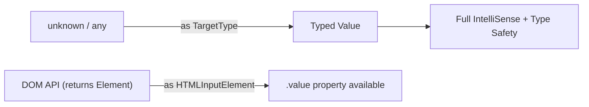

---

### 4. Code Examples

```typescript
// Basic assertion: you know the type the compiler doesn't
const input = document.getElementById("username") as HTMLInputElement;
console.log(input.value); // ✅ .value is now available

// JSON.parse returns 'any' — add a type assertion to restore safety
const raw = JSON.parse(response.body) as { userId: number; name: string };
console.log(raw.userId); // ✅ typed

// Asserting fetched config back to a known shape
const config = (await fetchConfig()) as AppConfig;
```

```typescript
// Non-null assertion operator (!)
// Use when YOU are certain a value is not null/undefined
// but TypeScript can't prove it

function getUser(id: string) {
    return db.find((u) => u.id === id); // returns User | undefined
}

const user = getUser("abc")!; // ← '!' asserts "this is NOT undefined"
console.log(user.name); // ✅ no error — but dangerous if wrong
```

```typescript
// Double assertion: "escape hatch" for incompatible types
// Only use when you are 100% certain about the runtime value
const x = someValue as unknown as SpecificType;
// first 'as unknown' widens to top type, then 'as SpecificType' narrows
// ⚠️ TypeScript won't stop you — this bypasses all safety
```

```typescript
// ❌ Wrong: assertion doesn't convert runtime values
const num = "forty" as number; // TypeScript will error — string ≠ number
// TypeScript only allows assertions to "overlap" with the current type
```

---

### 5. Common Mistakes

| Mistake                         | Why It's Wrong                                    | Fix                                                          |
| ------------------------------- | ------------------------------------------------- | ------------------------------------------------------------ |
| Using `!` on every nullable     | Defeats null-checking, causes crashes             | Use `if (value)` narrowing                                   |
| `as any` to silence errors      | Disables all checking downstream                  | Fix the actual type mismatch                                 |
| Double assertion for wrong type | No runtime safety at all                          | Only use when bridging known-compatible types                |
| Confusing `as` with casting     | `as` is compile-only; no runtime coercion happens | Use actual parsing/conversion functions for runtime coercion |

---

### 6. Interview Perspective

> Interviewers ask: _"What's the difference between a type assertion and a type cast?"_
> **Answer:** A type cast (C++, Java) changes the value at runtime. A TypeScript type assertion only changes the **compile-time** view — the runtime value is untouched. Also: _"When would you use `as unknown as T`?"_ — Only as a last resort when bridging incompatible third-party types that you have verified are safe at runtime.

---

### Session 2 Recap

- Primitive types: `number`, `string`, `boolean` — always use lowercase
- `void` (returns nothing), `never` (never returns), `null`/`undefined` (absent values)
- `any` is dangerous — disables all checking. `unknown` is safe — forces type check first
- Typed arrays ensure all elements are the same type
- Tuples are fixed-length arrays with position-based types
- `as Type` assertions override compiler inference (compile-time only, no runtime coercion)
- Non-null assertion `!` asserts a value is not null/undefined — use sparingly

---

### Conceptual Questions

1. You receive data from an API and don't know its structure. Should you type it as `any` or `unknown`? Why?
2. What is the difference between a function returning `void` vs returning `undefined`?

### Interview Questions

1. _"What is the difference between `any` and `unknown` in TypeScript? When would you use each?"_
2. _"What is a tuple in TypeScript and when would you prefer it over an array or object?"_

---

[↑ Back to TOC](#table-of-contents)

<a id="session-3"></a>

# SESSION 3 - Type Inference & Annotations

---

## Type Inference

> [↑ Back to TOC](#table-of-contents)

### 1. Concept Explanation

Type inference is TypeScript's ability to **automatically figure out the type** of a variable without you explicitly writing the annotation. When you write `let x = 5`, TypeScript automatically knows `x` is a `number`. You don't need `let x: number = 5`.

This makes TypeScript practical — you focus on annotating important boundaries (function parameters, public APIs) and let inference handle the rest.

---

### 2. Visual Representation

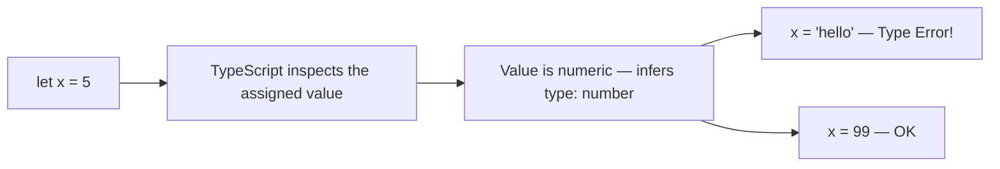

---

### 3. Code Examples

```typescript
// Variable inference
let count = 10; // inferred: number
let message = "hello"; // inferred: string
let done = false; // inferred: boolean
// count = "ten";        // ERROR: already inferred as number

// Array inference
let scores = [90, 85, 92]; // inferred: number[]
scores.push(100); // OK
// scores.push("A+");        // ERROR

// Object inference
let user = { name: "Alice", age: 30 };
// user is inferred as: { name: string; age: number }
user.name = "Bob"; // OK
// user.name = 99;    // ERROR: number not assignable to string

// Function return type inference
function add(a: number, b: number) {
    return a + b; // return type inferred as: number
}
let result = add(3, 4); // result inferred as number

// Contextual typing — inference from context
const names = ["Alice", "Bob", "Charlie"];
names.forEach((name) => {
    console.log(name.toUpperCase()); // name inferred as string
});

// When inference fails — annotate explicitly
let items = []; // inferred as: never[] — useless!
// items.push("hello"); // ERROR

let items2: string[] = []; // correct — annotate empty arrays
items2.push("hello"); // OK
```

---

### 4. Common Mistakes

The most common mistake is declaring an empty array without a type annotation. TypeScript infers it as `never[]` (an array that can never have elements). Always annotate empty arrays explicitly.

Function parameters are never inferred — they must always be explicitly annotated.

---

### 5. Interview Perspective

You may be asked: _"What is type inference in TypeScript and why is it useful?"_

Mention that TypeScript automatically deduces types from initial values, function returns, and context. It reduces verbosity while preserving full type safety. Also mention **contextual typing** — how TypeScript infers types in callbacks based on the surrounding array or event type.

---

---

## Explicit Annotations & Type Widening

> [↑ Back to TOC](#table-of-contents)

### 1. Concept Explanation

When you add `: Type` explicitly, you tell TypeScript what type something should be. Always annotate: function parameters, exported function return types, and variables initialized with `null` or assigned later.

**Type widening** is the concept that `let` makes TypeScript widen a literal to its base type (e.g., `"left"` becomes `string`), while `const` keeps the literal type.

---

### 2. Code Examples

```typescript
// Function parameters — ALWAYS annotate
function sendEmail(to: string, subject: string, body: string): void {}

// Variables initialized later
let currentUser: User | null = null;

// Exported functions — annotate return type
export function calculateDiscount(price: number, percent: number): number {
    return price - (price * percent) / 100;
}

// Type widening with let vs const
let direction = "left"; // type: string (widened — can be reassigned)
const direction2 = "left"; // type: "left" (literal — const never changes)

// Explicitly narrow with literal annotation
let dir: "left" | "right" | "up" | "down" = "left";
dir = "right"; // OK
// dir = "diagonal"; // ERROR
```

---

### 3. Interview Perspective

Interviewers may ask about **type widening**. When you use `let`, TypeScript widens to the general type. When you use `const`, it keeps the literal type. This is why `const` is often preferred in TypeScript for value objects and configuration.

---

### Session 3 Recap

- TypeScript infers types from initial values, returned values, and context
- Function parameters are never inferred — always annotate them
- Annotate empty arrays, null-initialized vars, and public function return types
- `let` causes type widening; `const` preserves literal types

---

### Conceptual Questions

1. What happens when TypeScript infers the type of an empty array `[]`? How do you fix it?
2. Why does `const x = "left"` give a different type than `let x = "left"`?

### Interview Questions

1. _"What is type inference in TypeScript? When should you still write explicit annotations?"_
2. _"What is type widening in TypeScript? How do `let` and `const` behave differently?"_

---

[↑ Back to TOC](#table-of-contents)

<a id="session-4"></a>

# SESSION 4 - Objects & Interfaces

---

## Interfaces

> [↑ Back to TOC](#table-of-contents)

### 1. Concept Explanation

An `interface` is TypeScript's way of naming and reusing an object shape. Think of it as a **contract** — any object that claims to be this type must have all the required properties with the correct types. Interfaces are purely a TypeScript feature: they are completely erased when compiled to JavaScript and have zero runtime overhead.

---

### 2. Why TypeScript Needs This

Without interfaces, you would copy the same inline object type `{ name: string; age: number }` everywhere. If the shape changes, you would update every copy. An interface centralizes the definition — you update one place and TypeScript catches all mismatches.

---

### 3. Visual Representation

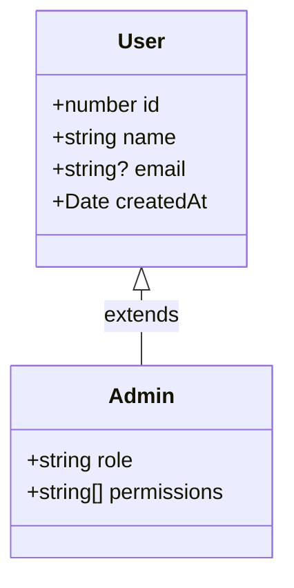

---

### 4. Code Examples

```typescript
// Basic interface
interface User {
    id: number;
    name: string;
    email: string;
}

const alice: User = { id: 1, name: "Alice", email: "alice@example.com" };
// const broken: User = { id: 2, name: "Bob" }; // ERROR: missing 'email'

// Optional properties — use ?
interface UserProfile {
    id: number;
    name: string;
    bio?: string; // optional — string or undefined
    avatarUrl?: string;
}

const userA: UserProfile = { id: 1, name: "Alice" }; // OK — bio is optional

// Readonly properties — cannot be reassigned after creation
interface Config {
    readonly apiKey: string;
    readonly baseUrl: string;
    timeout: number;
}
const config: Config = {
    apiKey: "abc123",
    baseUrl: "https://api.com",
    timeout: 5000,
};
config.timeout = 10000; // OK
// config.apiKey = "xyz";  // ERROR: readonly

// Extending interfaces
interface Animal {
    name: string;
    sound(): string;
}

interface Dog extends Animal {
    breed: string;
}

const rex: Dog = {
    name: "Rex",
    breed: "Labrador",
    sound: () => "Woof!",
};

// Multiple extension
interface Flyable {
    fly(): void;
}
interface Swimmable {
    swim(): void;
}
interface Duck extends Animal, Flyable, Swimmable {
    quack(): void;
}

// Index signatures — for unknown keys
interface Headers {
    [key: string]: string;
}
const requestHeaders: Headers = {
    "Content-Type": "application/json",
    Authorization: "Bearer token123",
};
```

---

### 5. Common Mistakes

A very common mistake is confusing `readonly` with deep immutability. If you have `readonly items: string[]`, the `items` reference cannot be reassigned, but the array itself can still be mutated with `.push()`, `.splice()`, etc. For truly immutable arrays, use `readonly string[]` or `ReadonlyArray<string>`.

---

### 6. Interface vs Type Alias

| Feature             | `interface` | `type`               |
| ------------------- | ----------- | -------------------- |
| Object shapes       | Primary use | Supported            |
| Union types         | Cannot      | `type A = B or C`    |
| Primitives          | Cannot      | `type ID = string`   |
| Declaration merging | Yes         | No                   |
| `extends` keyword   | Yes         | Use intersection `&` |

**Guideline:** Use `interface` for object shapes (especially when they might be extended). Use `type` for unions, intersections, and aliasing primitives.

---

### 7. Interview Perspective

A classic interview question: _"What is the difference between an `interface` and a `type` alias?"_

The key differences: interfaces support declaration merging (you can declare the same interface name twice and TypeScript merges them); type aliases cannot be re-declared. Type aliases support unions and can alias primitives; interfaces cannot. For extending, interfaces use `extends`; type aliases use `&` intersection.

---

### Session 4 Recap

- Interfaces define the shape (contract) of objects — required, optional (`?`), and readonly properties
- Interfaces can extend others using `extends` — even multiple at once
- Interfaces are erased at runtime — zero cost
- `readonly` prevents reassignment but does NOT make array contents immutable
- `interface` vs `type`: prefer `interface` for objects, `type` for unions and aliases

---

### Conceptual Questions

1. If interfaces are erased at runtime, how can TypeScript protect you from incorrect API responses?
2. You have `readonly id: number` on a User interface. Can you still modify a User object? What exactly is protected?

### Interview Questions

1. _"What is the difference between `interface` and `type` in TypeScript? When would you use each?"_
2. _"What does `readonly` do in TypeScript? Does it make objects deeply immutable?"_

---

[↑ Back to TOC](#table-of-contents)

<a id="session-5"></a>

# SESSION 5 - Advanced Types

---

## Union Types

> [↑ Back to TOC](#table-of-contents)

### 1. Concept Explanation

A **union type** allows a variable or parameter to hold one of several possible types. You write it with the `|` (pipe) symbol. Think of it as saying "this can be **either** A **or** B."

Real-world data often comes in multiple forms. A function might accept either a string ID or a numeric ID. A state machine might be in one of several states. Union types model this reality directly in the type system.

---

### 2. Why TypeScript Needs This

In JavaScript, developers handle multiple possible value types through runtime checks. Without TypeScript, there is no way to communicate to other developers that a function intentionally accepts multiple types. TypeScript's union types make this explicit, and together with **narrowing**, TypeScript automatically knows which type you're dealing with inside each branch.

---

### 3. Visual Representation

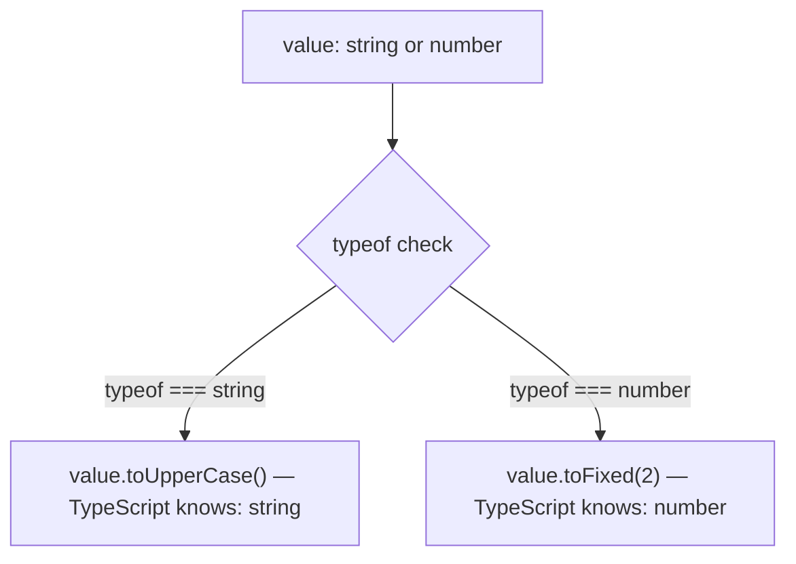

---

### 4. Code Examples

```typescript
// Basic union
type ID = string | number;

function findUser(id: ID): void {
    if (typeof id === "string") {
        console.log("String ID:", id.toUpperCase()); // TS knows: string
    } else {
        console.log("Numeric ID:", id.toFixed(0)); // TS knows: number
    }
}

findUser("user_abc"); // OK
findUser(42); // OK

// Discriminated Unions — THE most powerful pattern
// Each variant has a unique 'status' field TypeScript uses to distinguish them

type LoadingState = { status: "loading" };
type SuccessState = { status: "success"; data: string[] };
type ErrorState = { status: "error"; error: string };

type RequestState = LoadingState | SuccessState | ErrorState;

function renderState(state: RequestState): string {
    switch (state.status) {
        case "loading":
            return "Loading...";
        case "success":
            return state.data.join(", "); // TS knows: data exists here
        case "error":
            return `Error: ${state.error}`; // TS knows: error exists here
    }
}
```

---

---

## Intersection Types

> [↑ Back to TOC](#table-of-contents)

### 1. Concept Explanation

An **intersection type** combines multiple types into one. A variable must satisfy **all** types simultaneously. You write it with `&`. Think of it as "this must be **both** A **and** B."

---

### 2. Code Examples

```typescript
type WithId = { id: number };
type WithTimestamps = { createdAt: Date; updatedAt: Date };

// Every DB entity has both an ID and timestamps
type DbEntity = WithId & WithTimestamps;

interface Product {
    name: string;
    price: number;
}

// A DB product has all product fields PLUS all entity fields
type DbProduct = Product & DbEntity;

const laptop: DbProduct = {
    name: "Laptop",
    price: 999,
    id: 1,
    createdAt: new Date(),
    updatedAt: new Date(),
};
```

---

---

## Literal Types

> [↑ Back to TOC](#table-of-contents)

### 1. Concept Explanation

A **literal type** restricts a variable to an exact specific value, not just a category. Instead of saying "this is a `string`", you say "this is exactly the string `GET`". Combined with unions, literal types create type-safe enumerations without needing the `enum` keyword.

---

### 2. Code Examples

```typescript
// String literal type
type Direction = "north" | "south" | "east" | "west";

function move(direction: Direction, steps: number): void {
    console.log(`Moving ${steps} step(s) ${direction}`);
}

move("north", 3); // OK
// move("up", 1);   // ERROR: "up" not assignable to Direction

// HTTP methods — real-world use case
type HttpMethod = "GET" | "POST" | "PUT" | "PATCH" | "DELETE";

function makeRequest(url: string, method: HttpMethod): void {}

makeRequest("/users", "GET"); // OK
// makeRequest("/users", "FETCH"); // ERROR: catches typos

// as const — infer literal types from objects
const config2 = {
    env: "production", // without as const: inferred as string
    port: 3000, // without as const: inferred as number
} as const;
// With as const:
// config2.env is type "production" (not just string)
// config2.port is type 3000 (not just number)
```

---

### 3. Common Mistakes

A very common mistake is using `string` type where a literal union would give much more safety. Typing an HTTP method as `method: string` instead of `method: "GET" | "POST" | "PUT" | "DELETE"` accepts any string including typos like `"GETT"`. The literal union catches all typos at compile time.

---

### 4. Interview Perspective

Interviewers often ask: _"What is a discriminated union and why is it useful?"_

Answer: A discriminated union is a union of object types where each variant has a common literal property (the discriminant) with a unique value. TypeScript uses this property to narrow the type inside switch/if statements, giving you type-safe access to each variant's unique fields. It is the standard pattern for modeling state machines and API responses in TypeScript.

---

---

## Enums

> [↑ Back to TOC](#table-of-contents)

### 1. Concept Explanation

An **enum** (short for enumeration) is a TypeScript feature that lets you define a set of named constants. Instead of scattering magic strings or numbers throughout your code, you group them under one named type. For example, instead of using `"PENDING"`, `"ACTIVE"`, `"CLOSED"` as raw strings everywhere, you define a `Status` enum and use `Status.Active` — your code becomes self-documenting and resistant to typos.

TypeScript has three kinds of enums: **numeric** (auto-incremented numbers), **string** (explicit string values), and **const** (inlined at compile time, zero runtime cost).

---

### 2. Why TypeScript Needs This

In JavaScript, there is no native enum. Developers either use plain objects (`const STATUS = { ACTIVE: "ACTIVE" }`) or raw strings/numbers — both are error-prone. TypeScript's enum type gives you:

- Autocomplete for valid values
- A type that restricts assignment to only valid members
- A reverse mapping (numeric enums only) for debugging

---

### 3. Visual Representation

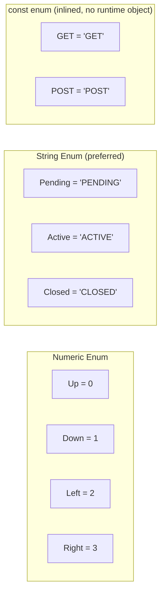

---

### 4. Code Examples

```typescript
// --- Numeric Enum (auto-increments from 0) ---
enum Direction {
    Up, // 0
    Down, // 1
    Left, // 2
    Right, // 3
}

let move: Direction = Direction.Up;
console.log(move); // 0
console.log(Direction[0]); // "Up" — reverse mapping (numeric enums only)

// --- String Enum (preferred — more debuggable) ---
// With numeric enums, you see "0" in logs. With string enums, you see "PENDING"
enum Status {
    Pending = "PENDING",
    Active = "ACTIVE",
    Closed = "CLOSED",
}

const userStatus: Status = Status.Active;
console.log(userStatus); // "ACTIVE" — readable in logs

function processOrder(status: Status): void {
    if (status === Status.Pending) {
        console.log("Order is waiting");
    }
}

processOrder(Status.Pending); // OK
// processOrder("PENDING");      // ERROR: string not assignable to Status

// --- Const Enum (inlined at compile time — zero runtime object) ---
const enum HttpMethod {
    GET = "GET",
    POST = "POST",
    PUT = "PUT",
    DELETE = "DELETE",
}

// At runtime, HttpMethod.GET is replaced with "GET" directly — no object exists
function makeRequest(url: string, method: HttpMethod): void {
    console.log(`${method} ${url}`);
}
makeRequest("/users", HttpMethod.GET); // compiled to: makeRequest("/users", "GET")
```

---

### 5. Enums vs Union Literal Types — The Key Comparison

This is a very common interview question. Both solve the same problem but in different ways.

```typescript
// Enum approach
enum Role {
    Admin = "ADMIN",
    User = "USER",
    Guest = "GUEST",
}

// Union literal approach (modern preference)
type Role2 = "ADMIN" | "USER" | "GUEST";
```

|                              | `enum`                         | Union Literal            |
| ---------------------------- | ------------------------------ | ------------------------ |
| Runtime object               | Yes (regular enum)             | No — compile-time only   |
| Tree-shakeable               | No (regular enum generates JS) | Yes                      |
| Reverse mapping              | Yes (numeric only)             | No                       |
| Extendable                   | No                             | No                       |
| Works with `Object.values()` | Yes                            | No                       |
| Debuggability                | Good (string enum)             | Better (just a string)   |
| Modern preference            | `const enum` only              | Preferred for most cases |

**Rule:** Use `const enum` when you need enum semantics with no runtime overhead. Use union literal types (`"A" | "B"`) for most cases — they are simpler and have less surprising behavior.

---

### 6. Common Mistakes

The most dangerous mistake is using regular (non-const) string enums and expecting them to be interchangeable with plain strings. They are not. `Status.Active === "ACTIVE"` is `true` at runtime, but TypeScript will not allow you to pass `"ACTIVE"` where `Status` is expected without an explicit assertion.

Another mistake: using numeric enums in serialized data (like JSON APIs). Because they compile to numbers, your API would send `0`, `1`, `2` instead of human-readable strings. Always use string enums for anything that crosses a system boundary.

---

### 7. Interview Perspective

A very common question: _"What is the difference between an enum and a union literal type in TypeScript? Which would you use?"_

Key answer: Enums compile to a real JavaScript object (except `const enum`), so they have a runtime presence. Union literal types exist only at compile time. For most cases, union literals are preferred because they are simpler, smaller in output, and do not create the "enum identity problem" (where TypeScript's structural typing breaks down slightly with enums). Use `const enum` for performance-critical constants or `enum` only when you need `Object.values()` or reverse mapping at runtime.

---

---

## Type Compatibility & Structural Typing

> [↑ Back to TOC](#table-of-contents)

### 1. Concept Explanation

TypeScript uses **structural typing** (also called "duck typing") to compare types — not by name, but by **shape**. Two types are compatible if one has all the properties that the other requires, regardless of what they are called. This is fundamentally different from languages like Java or C# which use **nominal typing** (types must explicitly declare they are related).

This means: if an object has all the required properties of a type, TypeScript accepts it — even if you never explicitly said "this object is of type X."

---

### 2. Why TypeScript Needs This

Structural typing fits perfectly with JavaScript's object model. In JavaScript, you don't declare that an object "is" a particular class — you just use it. TypeScript honors this by checking shapes, not names. This makes TypeScript flexible without sacrificing safety.

---

### 3. Visual Representation

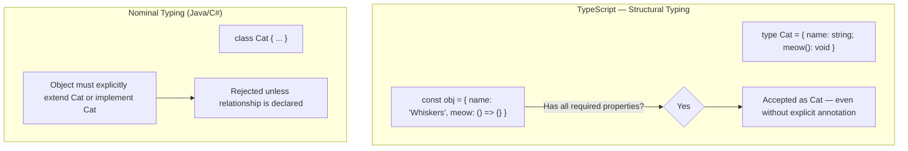

---

### 4. Code Examples

```typescript
// --- Structural typing in action ---
interface Point {
    x: number;
    y: number;
}

function printPoint(p: Point): void {
    console.log(`(${p.x}, ${p.y})`);
}

// This object is never declared as 'Point', but it has the right shape
const coord = { x: 10, y: 20, z: 30 }; // has extra property z — that's fine
printPoint(coord); // OK — TypeScript only checks that x and y exist

// --- Excess Property Checking (an important exception) ---
// TypeScript IS strict when you use object literals DIRECTLY
// printPoint({ x: 10, y: 20, z: 30 }); // ERROR — excess property in literal
// But assigning to a variable first bypasses this (as above)

// --- Type Compatibility with functions ---
type Logger = (message: string) => void;

// A function with FEWER parameters is compatible (safe — extras are ignored)
const simpleLogger: Logger = () => console.log("logged"); // OK — ignores message param
const fullLogger: Logger = (msg: string) => console.log(msg); // OK

// A function with MORE required parameters is NOT compatible
// type Detailed = (message: string, level: string) => void;
// const broken: Logger = (msg: string, level: string) => {}; // ERROR

// --- Why this matters: Array callbacks ---
// forEach expects: (value: T, index: number, array: T[]) => void
// But you can use just: (value: T) => void — fewer params is always OK
[1, 2, 3].forEach((n) => console.log(n)); // OK — ignores index and array params

// --- Class structural compatibility ---
class Dog {
    name: string;
    constructor(name: string) {
        this.name = name;
    }
    bark(): void {
        console.log("Woof");
    }
}

class Cat {
    name: string;
    constructor(name: string) {
        this.name = name;
    }
    bark(): void {
        console.log("Meow?");
    } // same structure as Dog!
}

// Because TypeScript is structural, Dog and Cat are compatible!
const animal: Dog = new Cat("Whiskers"); // OK — same shape

// --- Assignability rules summary ---
// A type S is assignable to type T if S has at least all properties of T
// (S can have MORE, but not LESS)
interface Named {
    name: string;
}
interface NamedAndAged {
    name: string;
    age: number;
}

let named: Named;
let full: NamedAndAged = { name: "Alice", age: 30 };

named = full; // OK — full has everything Named needs (plus more)
// full = named; // ERROR — named might not have 'age'
```

---

### 5. Common Mistakes

The most confusing mistake is the **excess property check** inconsistency. When you pass an object literal directly to a function, TypeScript does check for extra properties (to catch typos). But when you assign the object to a variable first and then pass the variable, TypeScript uses structural typing and ignores extra properties. This trips up many developers who expect consistent behavior.

Another mistake is thinking two classes with different names are always incompatible. In TypeScript, `class Dog` and `class Cat` with the same structure are completely interchangeable. If you need nominal typing (identity-based), use branded types.

---

### 6. Interview Perspective

_"What is structural typing in TypeScript?"_ — TypeScript checks type compatibility by shape (what properties/methods an object has), not by name. Two entirely unrelated types are compatible if they have the same structure.

_"What is excess property checking?"_ — A special rule that applies ONLY to object literals passed directly. TypeScript reports extra properties as errors in this case to catch typos in property names, even though the same object assigned to a variable would be accepted.

---

## Branded / Opaque Types

> [↑ Back to TOC](#table-of-contents)

### 1. Concept Explanation

TypeScript's structural type system means that two types with the same shape are completely interchangeable. This is useful most of the time, but sometimes you want two types to be **incompatible even if they have the same underlying structure**. For example, a `UserId` (which is a `string` under the hood) should not be accidentally assigned to an `EmailAddress` (also a `string`).

**Branded types** (also called opaque types) are a pattern — not a built-in feature — that adds a unique "brand" property to a type to make it nominally distinct. They use an intersection with a unique marker object to trick TypeScript's structural checker.

---

### 2. Why It Exists

In domain modeling you often have many string or number IDs: `UserId`, `ProductId`, `OrderId`, `Email`. Without branding, you can accidentally pass an `OrderId` where a `UserId` is expected — TypeScript won't complain because both are just `string`. Branded types create "compile-time distinct" IDs with zero runtime overhead.

---

### 3. Visual Representation

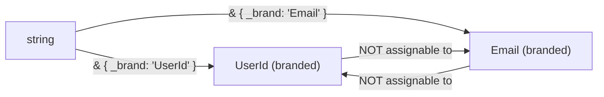

---

### 4. Code Examples

```typescript
// Brand declaration — the _brand property only exists in the type world
type Brand<T, B extends string> = T & { readonly _brand: B };

type UserId = Brand<string, "UserId">;
type Email = Brand<string, "Email">;
type OrderId = Brand<number, "OrderId">;

// "Constructor" functions that do the runtime conversion (just a cast)
const toUserId = (id: string): UserId => id as UserId;
const toEmail = (e: string): Email => e as Email;
const toOrderId = (n: number): OrderId => n as OrderId;

function getUser(id: UserId): void {
    console.log("Fetching user:", id);
}

const uid = toUserId("user-123");
const email = toEmail("a@b.com");

getUser(uid); // ✅ correct
getUser(email); // ❌ Argument of type 'Email' is not assignable to parameter of type 'UserId'
getUser("raw"); // ❌ plain string not accepted — must go through constructor
```

```typescript
// Practical use: preventing mixing of IDs in a service
type ProductId = Brand<number, "ProductId">;
type CategoryId = Brand<number, "CategoryId">;

function getProduct(id: ProductId) {
    /* ... */
}

const catId = 42 as CategoryId;
getProduct(catId); // ❌ Type 'CategoryId' is not assignable to type 'ProductId'
```

```typescript
// Validated string pattern — e.g., only non-empty strings
type NonEmptyString = Brand<string, "NonEmptyString">;

function makeNonEmpty(s: string): NonEmptyString {
    if (s.trim().length === 0) throw new Error("String is empty");
    return s as NonEmptyString;
}
```

---

### 5. Common Mistakes

| Mistake                                 | Why It's Wrong                                                             | Fix                                                              |
| --------------------------------------- | -------------------------------------------------------------------------- | ---------------------------------------------------------------- |
| Forgetting to use constructor functions | `"raw-string" as UserId` works but bypasses all validation logic           | Always create branded values through factory functions           |
| Adding `_brand` at runtime              | The brand property doesn't exist at runtime — it's only a type-level trick | Never read `._brand` in actual code                              |
| Using for everything                    | Overkill for simple cases with no domain confusion                         | Use when multiple IDs of same primitive type exist in one domain |

---

### 6. Interview Perspective

> Interviewers ask: _"How do you prevent mixing different ID types that are all `string` under the hood?"_
> **Answer:** Branded/opaque types — intersect `string` with a unique marker type to make TypeScript reject cross-type assignments at compile time, with zero runtime overhead. Also: _"Does branded typing require any runtime changes?"_ — No, it's purely a compile-time technique. The brand intersection is phantom — it never exists in the emitted JavaScript.

---

### Session 5 Recap

- Union types (`A | B`) — value can be one of several types; use `typeof` / `instanceof` to narrow
- Discriminated unions — each variant has a unique literal `status`/`kind` field; enables exhaustive switch checks
- Intersection types (`A & B`) — value must satisfy all types; great for mixins
- Literal types (`"GET" | "POST"`) — restrict to exact values; safer than plain `string`
- `as const` — prevents widening, makes all values their literal types
- **Enums** — named constants compiled to JS objects; prefer `const enum` or union literals for most cases
- **Structural typing** — TypeScript checks shape, not name; excess property checks apply only to object literals
- **Branded types** — phantom intersection brands prevent mixing same-primitive domain IDs at compile time

---

### Conceptual Questions

1. What is the difference between a union type `A | B` and an intersection type `A & B`?
2. What is a discriminated union? Why is the discriminant property important?

### Interview Questions

1. _"What are discriminated unions in TypeScript and when would you use them over regular union types?"_
2. _"What does `as const` do in TypeScript? Give an example of when it is useful."_

---

[↑ Back to TOC](#table-of-contents)

<a id="session-6"></a>

# SESSION 6 - Functions Deep Dive

---

## Function Signatures & Parameters

> [↑ Back to TOC](#table-of-contents)

### 1. Concept Explanation

In TypeScript, functions are fully typed — every parameter has a type and the return value has a type. This makes functions self-documenting: just by reading the signature, you know exactly what a function needs and what it gives back.

Beyond basic typing, TypeScript supports **optional parameters**, **default parameters**, **rest parameters**, and **function overloads** — all with full type safety.

---

### 2. Visual Representation


---

### 3. Code Examples

```typescript
// Basic typed function
function divide(dividend: number, divisor: number): number {
    if (divisor === 0) throw new Error("Cannot divide by zero");
    return dividend / divisor;
}

// Optional parameter — must come AFTER required parameters
function greet(name: string, title?: string): string {
    return title ? `Hello, ${title} ${name}!` : `Hello, ${name}!`;
}
greet("Alice"); // "Hello, Alice!"
greet("Alice", "Dr."); // "Hello, Dr. Alice!"

// Default parameter
function createUser(name: string, role: string = "user"): object {
    return { name, role };
}
createUser("Alice"); // { name: "Alice", role: "user" }
createUser("Bob", "admin"); // { name: "Bob", role: "admin" }

// Rest parameters
function logAll(prefix: string, ...messages: string[]): void {
    messages.forEach((msg) => console.log(`[${prefix}] ${msg}`));
}
logAll("INFO", "Server started", "Listening on port 3000");

// Function type alias
type MathOperation = (a: number, b: number) => number;

const add: MathOperation = (a, b) => a + b;
const subtract: MathOperation = (a, b) => a - b;

// Higher-order function (takes a function as argument)
function applyOperation(a: number, b: number, op: MathOperation): number {
    return op(a, b);
}
applyOperation(10, 3, add); // 13
applyOperation(10, 3, subtract); // 7

// Function that returns a function
function multiplier(factor: number): (x: number) => number {
    return (x) => x * factor;
}
const double = multiplier(2);
double(5); // 10
```

---

---

## Function Overloads

> [↑ Back to TOC](#table-of-contents)

### 1. Concept Explanation

Function overloads allow a single function to accept different combinations of argument types, each with its own typed behavior. You write multiple function **signatures** (the overloads) above the actual **implementation**. External callers can only use the overloaded signatures.

---

### 2. Code Examples

```typescript
// Overload signatures (what callers can use)
function format(value: string): string;
function format(value: number, decimals: number): string;

// Implementation (must handle all cases — not directly callable from outside)
function format(value: string | number, decimals?: number): string {
    if (typeof value === "string") {
        return value.trim().toUpperCase();
    } else {
        return value.toFixed(decimals ?? 2);
    }
}

format("  hello  "); // "HELLO"
format(3.14159, 2); // "3.14"
// format(3.14159);     // ERROR: no overload matches (missing decimals)
```

---

### 3. Common Mistakes

The most common mistake is writing the implementation signature as one of the overload signatures. The implementation is the "catch-all" and should be broader than any individual overload. Callers cannot use the implementation signature directly — they must match one of the named overloads.

---

### 4. Interview Perspective

_"When would you use function overloads in TypeScript?"_

Answer: When a function needs to accept fundamentally different argument shapes and when the return type depends on the specific combination of arguments. A good real-world example is a DOM `createElement` function that returns different element types based on the tag name string.

---

### Session 6 Recap

- All function parameters must be typed; return types are inferred but explicit annotation is recommended
- Optional `param?: string`, default `param: string = "default"`, rest `...args: T[]`
- Function type aliases make functions first-class typed values
- Function overloads allow one function name to handle multiple distinct call signatures

---

### Conceptual Questions

1. What is the difference between an optional parameter (`param?: string`) and a parameter with a default value (`param: string = "default"`)?
2. Can you write function overloads with an arrow function? Why or why not?

### Interview Questions

1. _"What are function overloads in TypeScript and what problem do they solve?"_
2. _"How would you type a higher-order function that takes a callback and returns a modified version of it?"_

---

[↑ Back to TOC](#table-of-contents)

<a id="session-7"></a>

# SESSION 7 - Generics

---

## What Are Generics?

> [↑ Back to TOC](#table-of-contents)

### 1. Concept Explanation

Generics allow you to write **reusable, type-safe code** that works with any type, rather than a specific fixed type. Instead of hardcoding a type, you use a **type parameter** — a placeholder (usually written as `<T>`) that gets filled in with a real type when the function, interface, or class is used.

Think of a generic as a template. A generic `identity` function says: "Give me any value of type `T`, and I'll return a value of type `T`." When you call it with a `string`, `T` becomes `string`. When you call it with a `number`, `T` becomes `number`.

---

### 2. Why Generics Exist

Without generics, you would have two bad choices: write a separate function for every type (massive code duplication), or use `any` and lose all type safety. Generics give you a third option: **write once, work with any type, stay fully type-safe**.

---

### 3. Visual Representation

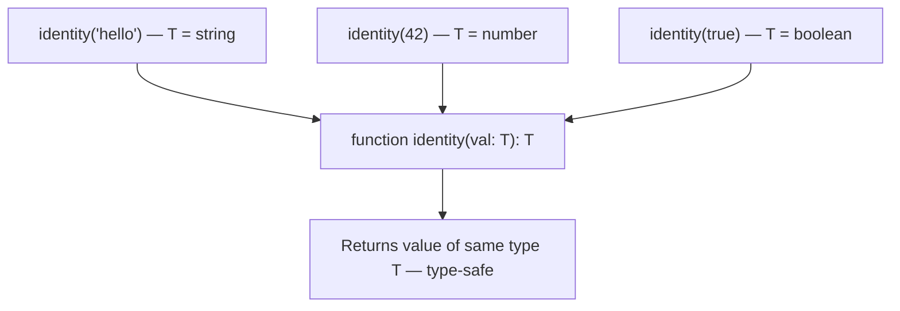

---

### 4. Code Examples

```typescript
// The simplest generic: identity
function identity<T>(value: T): T {
    return value;
}
const str = identity("hello"); // T = string
const num = identity(42); // T = number
const bool = identity(true); // T = boolean

// Generic array function
function firstElement<T>(arr: T[]): T | undefined {
    return arr[0];
}
const first1 = firstElement([1, 2, 3]); // number | undefined
const first2 = firstElement(["a", "b", "c"]); // string | undefined

// Multiple type parameters
function pair<K, V>(key: K, value: V): [K, V] {
    return [key, value];
}
const p1 = pair("name", "Alice"); // [string, string]
const p2 = pair(1, true); // [number, boolean]

// Generic Interface — reusable API response wrapper
interface ApiResponse<T> {
    data: T;
    status: number;
    message: string;
}

interface User {
    id: number;
    name: string;
}

const userResponse: ApiResponse<User> = {
    data: { id: 1, name: "Alice" },
    status: 200,
    message: "OK",
};

const listResponse: ApiResponse<User[]> = {
    data: [
        { id: 1, name: "Alice" },
        { id: 2, name: "Bob" },
    ],
    status: 200,
    message: "OK",
};

// Generic Class
class Stack<T> {
    private items: T[] = [];

    push(item: T): void {
        this.items.push(item);
    }
    pop(): T | undefined {
        return this.items.pop();
    }
    peek(): T | undefined {
        return this.items[this.items.length - 1];
    }
    get size(): number {
        return this.items.length;
    }
}

const numStack = new Stack<number>();
numStack.push(1);
numStack.push(2);
numStack.pop(); // 2 — TypeScript knows this is number | undefined

// const strStack = new Stack<string>();
// strStack.push(99); // ERROR: number not assignable to string

// Generic Constraints — limit which types T can be
function getLength<T extends { length: number }>(item: T): number {
    return item.length;
}
getLength("hello"); // 5 — string has .length
getLength([1, 2, 3]); // 3 — array has .length
// getLength(42);           // ERROR: number has no .length

// keyof constraint — the most important generic pattern
function getProperty<T, K extends keyof T>(obj: T, key: K): T[K] {
    return obj[key];
}

const user = { id: 1, name: "Alice", role: "admin" };
const name = getProperty(user, "name"); // string
const id = getProperty(user, "id"); // number
// getProperty(user, "email");            // ERROR: email is not keyof typeof user
```

---

### 5. Common Mistakes

The most common mistake is defaulting to `any` when you don't know the type. Generics are the correct solution. `any` loses all type information; generics preserve and propagate it.

Another mistake is over-constraining generics. If you write `<T extends User>`, it only works for `User` types. If the logic would work for any object, use a minimal constraint like `<T extends object>`.

---

### 6. Interview Perspective

Generics are one of the most common TypeScript interview topics. You will almost certainly be asked: _"What are generics in TypeScript and why are they useful?"_

The ideal answer:

1. What they are: type parameters that let you write reusable functions/classes for any type
2. Why they exist: type-safe alternative to `any` when you don't know the type in advance
3. A concrete example: `ApiResponse<T>` wrapper or `firstElement<T>`
4. Constraints: `T extends X` to limit what types can fill `T`

You may also be asked to write `getProperty<T, K extends keyof T>(obj: T, key: K): T[K]` — this is the canonical generic constraint pattern.

---

### Session 7 Recap

- Generics are type parameters (`<T>`) that make functions/interfaces/classes reusable with any type
- They are the type-safe alternative to `any` for cases where you don't know the type in advance
- Constraints (`<T extends X>`) limit which types can fill `T`
- `<T, K extends keyof T>` is the standard pattern for safe property access
- Generic interfaces like `ApiResponse<T>` are the backbone of well-typed APIs

---

### Conceptual Questions

1. What is the difference between `function f(x: any)` and `function f<T>(x: T)`? When would you choose generics over `any`?
2. What does `K extends keyof T` mean? Why is this constraint needed for the `getProperty` function?

### Interview Questions

1. _"Explain generics in TypeScript with a real-world example."_
2. _"Write a generic function `getProperty<T, K extends keyof T>(obj: T, key: K): T[K]`. What does each type parameter do?"_

---

[↑ Back to TOC](#table-of-contents)

<a id="session-8"></a>

# SESSION 8 - Classes & OOP

---

## Classes in TypeScript

> [↑ Back to TOC](#table-of-contents)

### 1. Concept Explanation

TypeScript enhances JavaScript classes with **access modifiers** (`public`, `private`, `protected`), `readonly` properties, `abstract` classes, and interface implementation. In JavaScript, there is no real concept of "private" — it is all convention. TypeScript enforces access at compile time.

---

### 2. Visual Representation

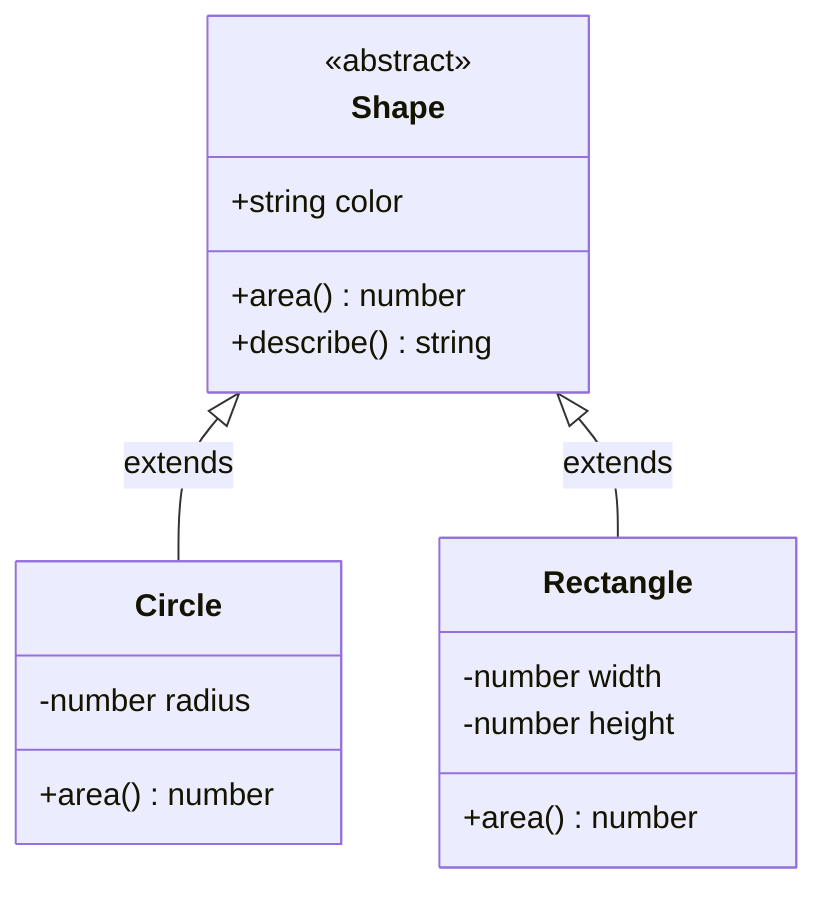

---

### 3. Access Modifiers

| Modifier           | Accessible from                               |
| ------------------ | --------------------------------------------- |
| `public` (default) | Anywhere                                      |
| `private`          | Only inside the class                         |
| `protected`        | Inside the class AND subclasses               |
| `readonly`         | Can be read anywhere, set only in constructor |

---

### 4. Code Examples

```typescript
// Access modifiers
class BankAccount {
    public owner: string; // accessible from anywhere
    private balance: number; // only inside BankAccount
    protected accountType: string; // inside + subclasses

    constructor(owner: string, initialBalance: number) {
        this.owner = owner;
        this.balance = initialBalance;
        this.accountType = "checking";
    }

    deposit(amount: number): void {
        if (amount <= 0) throw new Error("Amount must be positive");
        this.balance += amount;
    }

    getBalance(): number {
        return this.balance; // OK — inside the class
    }
}

const account = new BankAccount("Alice", 1000);
account.deposit(500);
account.getBalance(); // 1500
// account.balance;    // ERROR: 'balance' is private

// Parameter Properties shorthand
// Instead of declaring + assigning in constructor separately:
class Product {
    constructor(
        public readonly id: number,
        public name: string,
        private price: number,
    ) {}
    // TypeScript auto-creates AND assigns all three properties

    getPrice(): number {
        return this.price;
    }
}

const laptop = new Product(1, "Laptop", 999);
laptop.name; // OK
// laptop.id = 2;    // ERROR: readonly
// laptop.price;     // ERROR: private

// Inheritance
class SavingsAccount extends BankAccount {
    private interestRate: number;

    constructor(owner: string, balance: number, rate: number) {
        super(owner, balance); // must call super before using 'this'
        this.interestRate = rate;
        this.accountType = "savings"; // OK — protected
    }

    applyInterest(): void {
        const interest = this.getBalance() * this.interestRate;
        this.deposit(interest);
    }
}

// Abstract Classes — cannot be instantiated directly
abstract class Shape {
    constructor(public color: string) {}

    abstract area(): number; // no implementation — subclass MUST provide it

    describe(): string {
        return `A ${this.color} shape with area ${this.area().toFixed(2)}`;
    }
}

class Circle extends Shape {
    constructor(
        color: string,
        private radius: number,
    ) {
        super(color);
    }
    area(): number {
        return Math.PI * this.radius ** 2;
    }
}

// const shape = new Shape("red"); // ERROR: cannot create abstract class instance
const circle = new Circle("red", 5);
circle.describe(); // "A red shape with area 78.54"

// Implementing Interfaces
interface Serializable {
    serialize(): string;
    deserialize(data: string): void;
}

class UserService implements Serializable {
    private users: string[] = [];

    serialize(): string {
        return JSON.stringify(this.users);
    }
    deserialize(data: string): void {
        this.users = JSON.parse(data);
    }
}
```

---

### 5. Common Mistakes

A common mistake is forgetting that TypeScript's `private` is compile-time only. At runtime the property is fully accessible in JavaScript. For true runtime privacy, use JavaScript's native `#name` syntax (private class fields). TypeScript supports this: `#balance: number`.

---

### 6. Interview Perspective

Common interview questions:

- _"What are access modifiers in TypeScript?"_ — `public` (default), `private` (class only), `protected` (class + subclasses)
- _"What is an abstract class and when would you use it over an interface?"_ — Abstract classes can have implemented methods and hold state; interfaces are pure contracts with no implementation. Use abstract when subclasses share base behavior but differ in specific methods.
- _"What is the difference between TypeScript `private` and JavaScript `#` private fields?"_ — TypeScript `private` is compile-time only. `#field` is a JavaScript language feature with true runtime privacy.

---

### Session 8 Recap

- `public` (default), `private` (class only), `protected` (class + subclasses)
- Parameter properties shorthand: `constructor(public name: string)` creates and assigns automatically
- Abstract classes provide base implementations but cannot be instantiated; subclasses must implement abstract methods
- `implements` enforces interface contracts on a class
- TypeScript `private` is compile-time only; `#field` gives true runtime privacy

---

### Conceptual Questions

1. What is the difference between `abstract class` and `interface`? When would you choose one over the other?
2. If TypeScript's `private` modifier is compile-time only, does it provide real security?

### Interview Questions

1. _"What are the access modifiers in TypeScript? How do `private` and `protected` differ?"_
2. _"What is an abstract class in TypeScript and how does it differ from an interface?"_

---

---

## Decorators

> [↑ Back to TOC](#table-of-contents)

### 1. Concept Explanation

A **decorator** is a special kind of function that can be attached to a class, method, property, or parameter using the `@` symbol. When applied, the decorator receives the target it is attached to and can **read, modify, or replace** it. Decorators enable you to add behavior to code declaratively — without modifying the code itself.

Decorators are heavily used in **NestJS** (the most popular Node.js framework for production APIs) — `@Controller()`, `@Get()`, `@Injectable()`, `@Body()` are all decorators. Understanding them is essential for any Node.js developer.

> Enable decorators in tsconfig: `"experimentalDecorators": true`

---

### 2. Why Decorators Exist

Without decorators, cross-cutting concerns (logging, validation, authentication, dependency injection) require you to modify every function and class manually. Decorators let you write this logic once and apply it anywhere declaratively. This is the core pattern behind NestJS and many testing/ORM frameworks.

---

### 3. Visual Representation

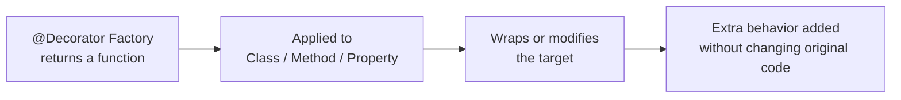

---

### 4. Code Examples

```typescript
// tsconfig.json — enable this first:
// "experimentalDecorators": true

// ===========================================
// CLASS DECORATOR
// ===========================================

// A class decorator receives the class constructor
function Singleton<T extends { new (...args: unknown[]): object }>(Base: T) {
    let instance: InstanceType<T>;
    return class extends Base {
        constructor(...args: unknown[]) {
            if (!instance) {
                super(...args);
                instance = this as InstanceType<T>;
            }
            return instance;
        }
    };
}

@Singleton
class DatabaseConnection {
    constructor(public url: string) {
        console.log("Connecting to:", url);
    }
}

const db1 = new DatabaseConnection("mongodb://localhost");
const db2 = new DatabaseConnection("mongodb://localhost");
console.log(db1 === db2); // true — same instance

// ===========================================
// METHOD DECORATOR
// ===========================================

// Method decorator to log call info automatically
function Log(
    target: object,
    propertyKey: string,
    descriptor: PropertyDescriptor,
) {
    const originalMethod = descriptor.value;

    descriptor.value = function (...args: unknown[]) {
        console.log(`[${propertyKey}] called with:`, args);
        const result = originalMethod.apply(this, args);
        console.log(`[${propertyKey}] returned:`, result);
        return result;
    };

    return descriptor;
}

class Calculator {
    @Log
    add(a: number, b: number): number {
        return a + b;
    }
}

const calc = new Calculator();
calc.add(3, 4);
// Logs: [add] called with: [3, 4]
// Logs: [add] returned: 7

// ===========================================
// PROPERTY DECORATOR
// ===========================================

function ReadOnly(target: object, propertyKey: string) {
    Object.defineProperty(target, propertyKey, {
        writable: false,
        configurable: false,
    });
}

class AppConfig {
    @ReadOnly
    version = "1.0.0";
}

// ===========================================
// DECORATOR FACTORY (most common pattern)
// ===========================================

// A factory returns the actual decorator, allowing configuration
function MinLength(min: number) {
    return function (target: object, propertyKey: string) {
        let value: string;
        Object.defineProperty(target, propertyKey, {
            get: () => value,
            set: (newVal: string) => {
                if (newVal.length < min) {
                    throw new Error(
                        `${propertyKey} must be at least ${min} characters`,
                    );
                }
                value = newVal;
            },
        });
    };
}

class User {
    @MinLength(3)
    name: string = "";
}

const user = new User();
user.name = "Al"; // ERROR thrown: name must be at least 3 characters
user.name = "Alice"; // OK

// ===========================================
// NESTJS-STYLE DECORATORS (how real frameworks use them)
// ===========================================

// This shows the pattern NestJS uses internally:
function Controller(path: string) {
    return function (target: Function) {
        Reflect.defineMetadata("path", path, target);
    };
}

function Get(path: string = "") {
    return function (
        target: object,
        key: string,
        descriptor: PropertyDescriptor,
    ) {
        Reflect.defineMetadata("method", "GET", target, key);
        Reflect.defineMetadata("path", path, target, key);
        return descriptor;
    };
}

// Usage (like NestJS):
// @Controller("/users")
// class UsersController {
//   @Get("/:id")
//   getUser() { ... }
// }
```

---

### 5. Decorator Execution Order

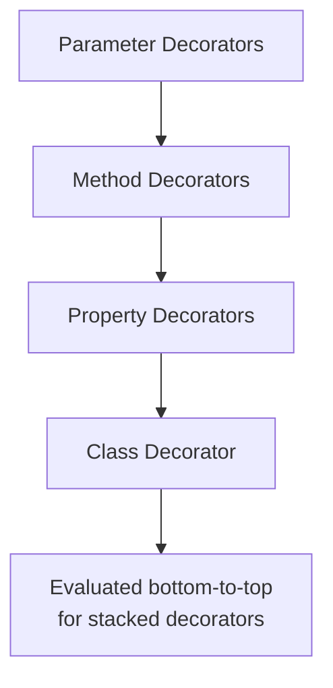

When multiple decorators are stacked, they are **evaluated top-to-bottom** but **applied bottom-to-top**:

```typescript
@DecoratorA // applied second
@DecoratorB // applied first
class MyClass {}
```

---

### 6. Common Mistakes

The most common mistake is forgetting to add `"experimentalDecorators": true` and `"emitDecoratorMetadata": true` to tsconfig. Without these, decorators either don't work or don't have access to type metadata.

Another mistake is using decorators for simple things that could be a function call. Decorators shine for cross-cutting concerns (logging, validation, dependency injection). They are overkill for ordinary logic.

---

### 7. Interview Perspective

_"What are decorators in TypeScript? Where are they used?"_

Answer: Decorators are functions that modify classes, methods, properties, or parameters using the `@` syntax. They enable declarative, reusable behavior — used extensively in NestJS (`@Controller`, `@Injectable`, `@Get`), TypeORM (`@Entity`, `@Column`), and class-validator (`@IsEmail`, `@MinLength`). They require `"experimentalDecorators": true` in tsconfig.

_"What is the difference between a decorator and a higher-order function?"_

Answer: Both wrap behavior, but decorators are applied at **class definition time** (not at call time) using special metadata. Decorators are syntactic sugar designed specifically for classes and their members.

---

[↑ Back to TOC](#table-of-contents)

<a id="session-9"></a>

# SESSION 9 - Advanced TypeScript

---

## Type Narrowing & Type Guards

> [↑ Back to TOC](#table-of-contents)

### 1. Concept Explanation

**Type narrowing** is the process by which TypeScript automatically restricts (narrows) the type of a variable inside a conditional block. When you check `typeof x === "string"`, TypeScript knows that inside that `if` block, `x` is a `string`, not a `string | number`. This happens automatically — TypeScript tracks types through your control flow.

A **type guard** is any expression that narrows a type. TypeScript has built-in guards (`typeof`, `instanceof`, `in`), and you can write **custom type guards** using predicates.

---

### 2. Code Examples

```typescript
// typeof guard
function processInput(input: string | number | boolean) {
    if (typeof input === "string") {
        console.log(input.toUpperCase()); // input: string
    } else if (typeof input === "number") {
        console.log(input.toFixed(2)); // input: number
    } else {
        console.log(`Boolean: ${input}`); // input: boolean
    }
}

// instanceof guard
class ApiError extends Error {
    constructor(
        public statusCode: number,
        message: string,
    ) {
        super(message);
    }
}

function handleError(err: unknown): string {
    if (err instanceof ApiError) {
        return `API Error ${err.statusCode}: ${err.message}`; // err: ApiError
    } else if (err instanceof Error) {
        return `Error: ${err.message}`;
    } else {
        return "Unknown error";
    }
}

// in operator guard
interface Admin {
    role: "admin";
    deleteUser(id: number): void;
}
interface RegularUser {
    role: "user";
    profile: string;
}

function handleUser(user: Admin | RegularUser) {
    if ("deleteUser" in user) {
        user.deleteUser(1); // user: Admin
    } else {
        console.log(user.profile); // user: RegularUser
    }
}

// Custom type guard (user-defined predicate)
interface Cat {
    meow(): void;
}
interface Dog {
    bark(): void;
}

function isCat(animal: Cat | Dog): animal is Cat {
    return "meow" in animal;
    // If this returns true, TypeScript narrows to Cat
}

function makeNoise(animal: Cat | Dog) {
    if (isCat(animal)) {
        animal.meow(); // Cat
    } else {
        animal.bark(); // Dog
    }
}
```

---

---

## keyof and typeof Operators

> [↑ Back to TOC](#table-of-contents)

### 1. Concept Explanation

TypeScript's `keyof` operator produces a union type of all the keys of a given type. `keyof User` gives you `"id" | "name" | "email"`. This is used extensively with generics for type-safe property access.

TypeScript's `typeof` in a **type context** extracts the TypeScript type of a variable — resolved at compile time, not runtime. This is different from JavaScript's runtime `typeof`.

---

### 2. Code Examples

```typescript
// keyof
interface User {
    id: number;
    name: string;
    email: string;
}

type UserKeys = keyof User; // "id" | "name" | "email"

function pluck<T, K extends keyof T>(items: T[], key: K): T[K][] {
    return items.map((item) => item[key]);
}

const users: User[] = [
    { id: 1, name: "Alice", email: "a@a.com" },
    { id: 2, name: "Bob", email: "b@b.com" },
];

const names = pluck(users, "name"); // string[]
const ids = pluck(users, "id"); // number[]
// pluck(users, "age");              // ERROR: 'age' not in keyof User

// typeof (type context)
const defaultConfig = {
    host: "localhost",
    port: 3000,
    debug: false,
};

// Extract the type from the runtime value — no need to define it twice
type Config = typeof defaultConfig;
// { host: string; port: number; debug: boolean }

function applyConfig(cfg: Config): void {
    /* ... */
}
```

---

---

## Utility Types

> [↑ Back to TOC](#table-of-contents)

These are ready-made generic types built into TypeScript's standard library.

```typescript
interface User {
    id: number;
    name: string;
    email: string;
    role: "admin" | "user";
}

// Partial — all optional
type UpdateUserDto = Partial<User>;
// { id?: number; name?: string; email?: string; role?: ... }

// Required — all required (opposite of Partial)
type StrictUser = Required<User>;

// Readonly — all readonly
type ImmutableUser = Readonly<User>;

// Pick — select subset of properties
type UserSummary = Pick<User, "id" | "name">;
// { id: number; name: string }

// Omit — exclude properties
type UserWithoutId = Omit<User, "id">;
// { name: string; email: string; role: ... }

// Record — key-value mapping
type UserById = Record<number, User>;
const cache: UserById = {
    1: { id: 1, name: "Alice", email: "a@a.com", role: "user" },
};

// Exclude — remove from union
type NonAdminRole = Exclude<"admin" | "user" | "guest", "admin">;
// "user" | "guest"

// Extract — keep matching from union
type AdminOnly = Extract<"admin" | "user" | "guest", "admin">;
// "admin"

// NonNullable — remove null and undefined
type SafeString = NonNullable<string | null | undefined>;
// string

// ReturnType — extract return type of function
async function getUser(id: number): Promise<User> {
    return { id, name: "Alice", email: "a@a.com", role: "user" };
}
type GetUserResult = Awaited<ReturnType<typeof getUser>>; // User

// Parameters — extract function params as tuple
type GetUserParams = Parameters<typeof getUser>; // [id: number]
```

---

---

## Mapped & Conditional Types

> [↑ Back to TOC](#table-of-contents)

### Mapped Types

Iterates over the keys of a type to create a new type. This is how `Partial`, `Readonly`, etc. are implemented internally.

```typescript
// How Partial<T> works internally
type MyPartial<T> = {
    [K in keyof T]?: T[K]; // Make every property optional
};

// How Readonly<T> works internally
type MyReadonly<T> = {
    readonly [K in keyof T]: T[K];
};

// Custom: make all properties nullable
type Nullable<T> = {
    [K in keyof T]: T[K] | null;
};

// Remove readonly (minus sign removes modifier)
type Mutable<T> = {
    -readonly [K in keyof T]: T[K];
};
```

### Conditional Types

```typescript
// T extends U ? X : Y
type IsString<T> = T extends string ? true : false;
type A = IsString<"hello">; // true
type B = IsString<42>; // false

// infer — extract a type inside a conditional
type UnpackArray<T> = T extends Array<infer Item> ? Item : T;
type Num = UnpackArray<number[]>; // number
type Str = UnpackArray<string>; // string (not an array, returns T itself)
```

---

---

## Template Literal Types

> [↑ Back to TOC](#table-of-contents)

### 1. Concept Explanation

**Template literal types** bring JavaScript template literal syntax into the type system. Just like you can build strings with `` `Hello ${name}` `` at runtime, you can build union types with `` `on${EventName}` `` at compile time. This lets you generate entire families of string types from smaller building blocks — without writing them all out manually.

They are particularly powerful for typing event names, CSS properties, API routes, and any pattern where string structure carries meaning.

---

### 2. Why TypeScript Needs This

Before template literal types (added in TS 4.1), you had to manually list every possible string combination. If you had 4 sides × 2 properties = 8 strings, you wrote all 8. With template literal types, TypeScript generates them automatically — and keeps them in sync whenever the source types change.

---

### 3. Code Examples

```typescript
// --- Basic template literal type ---
type Greeting = `Hello, ${string}!`;
const g: Greeting = "Hello, Alice!"; // OK
// const bad: Greeting = "Hi, Alice!"; // ERROR — must start with "Hello, "

// --- Union distribution (generates all combinations) ---
type Side = "top" | "bottom" | "left" | "right";
type Box = "margin" | "padding";
type BoxSide = `${Box}-${Side}`;
// "margin-top" | "margin-bottom" | "margin-left" | "margin-right"
// "padding-top" | "padding-bottom" | "padding-left" | "padding-right"

// --- Event handler naming pattern ---
type EventName = "click" | "focus" | "blur" | "change";
type EventHandler = `on${Capitalize<EventName>}`;
// "onClick" | "onFocus" | "onBlur" | "onChange"

// --- Real-world: typed object with getter/setter names ---
type Getters<T extends object> = {
    [K in keyof T as `get${Capitalize<string & K>}`]: () => T[K];
};

interface User {
    name: string;
    age: number;
}
type UserGetters = Getters<User>;
// { getName: () => string; getAge: () => number }

// --- API route typing ---
type HttpMethod = "GET" | "POST" | "PUT" | "DELETE";
type ApiVersion = "v1" | "v2";
type ApiRoute = `/${ApiVersion}/users${string}`;

const route: ApiRoute = "/v1/users/123"; // OK
// const bad: ApiRoute = "/v3/users";    // ERROR

// --- String manipulation utility types ---
type Upper = Uppercase<"hello">; // "HELLO"
type Lower = Lowercase<"HELLO">; // "hello"
type Capped = Capitalize<"hello">; // "Hello"
type Uncapped = Uncapitalize<"Hello">; // "hello"
```

---

### 4. Interview Perspective

_"What are template literal types in TypeScript? Give a real-world example."_

Answer: Template literal types let you build new string types by combining literals and unions using template syntax. A common example is generating CSS property names like `` `${Box}-${Side}` `` which produces all margin/padding combinations automatically. They are also used to create getter/setter method names from interface keys.

---

---

## The `satisfies` Operator (TS 4.9+)

> [↑ Back to TOC](#table-of-contents)

### 1. Concept Explanation

The `satisfies` operator validates that an expression matches a type **without changing the inferred type**. This solves a specific problem: when you annotate a variable with a type, TypeScript widens the type to that annotation. `satisfies` lets you check the type for correctness while still keeping the narrow inferred type for downstream use.

Think of it as: "check that this matches the type, but don't lose the specific details I know about this value."

---

### 2. Why TypeScript Needs This

Before `satisfies`, you had a trade-off:

- **Without annotation:** TypeScript keeps narrow types but no type-checking against a contract
- **With annotation:** TypeScript checks the contract but widens your type, losing specific info

`satisfies` gives you both: check + narrowness.

---

### 3. Code Examples

```typescript
type ColorValue = string | [number, number, number];
type Palette = Record<"red" | "green" | "blue", ColorValue>;

// Problem WITHOUT satisfies:
// Option 1 — annotate: loses narrow types
const palette1: Palette = {
    red: [255, 0, 0],
    green: "#00ff00",
    blue: [0, 0, 255],
};
// palette1.green is ColorValue (string | [number,number,number])
// palette1.green.toUpperCase(); // ERROR — might be a tuple

// Option 2 — no annotation: keeps narrow types but no contract check
const palette2 = {
    red: [255, 0, 0],
    green: "#00ff00",
    blue: [0, 0, 255],
};
// palette2.green is string ✅ but typos in keys go undetected

// WITH satisfies — best of both:
const palette3 = {
    red: [255, 0, 0],
    green: "#00ff00",
    blue: [0, 0, 255],
} satisfies Palette;

palette3.green.toUpperCase(); // ✅ TypeScript knows green is still string (not widened)
palette3.red[0]; // ✅ TypeScript knows red is [number,number,number]

// satisfies also catches contract violations:
const broken = {
    red: [255, 0, 0],
    green: "#00ff00",
    // blue: missing!   // ERROR: Property 'blue' is missing
} satisfies Palette;

// --- Another common use: config objects ---
type Config = { port: number; host: string; debug?: boolean };

const serverConfig = {
    port: 3000,
    host: "localhost",
    debug: true,
} satisfies Config;
// serverConfig.port is still 3000 (literal), not just number
```

---

### 4. Interview Perspective

_"What is the `satisfies` operator in TypeScript and when would you use it over a type annotation?"_

Answer: `satisfies` validates that a value conforms to a type without widening the inferred type. Use it when you want type-checking of a contract AND need to keep specific narrow type information for subsequent use. Classic example: a palette object where you want to verify all required color keys are present, but still know which values are strings vs tuples for individual entries.

---

---

## Recursive Types

> [↑ Back to TOC](#table-of-contents)

### 1. Concept Explanation

A **recursive type** is a type that references itself in its own definition. This is necessary for modeling tree-like or nested data structures — such as JSON values, file system trees, comment threads with replies, or nested configuration objects. Without recursive types, you would have to create an infinite number of types for each nesting level.

---

### 2. Code Examples

```typescript
// --- JSON value type (classic recursive example) ---
type JsonValue =
    | string
    | number
    | boolean
    | null
    | JsonValue[] // array of JsonValue
    | { [key: string]: JsonValue }; // object with JsonValue values

const data: JsonValue = {
    name: "Alice",
    age: 30,
    address: {
        city: "London",
        zip: "EC1A",
        coords: [51.5, -0.12], // nested array
    },
    active: true,
    notes: null,
};

// --- Tree structure ---
interface TreeNode<T> {
    value: T;
    children: TreeNode<T>[]; // references itself
}

const tree: TreeNode<string> = {
    value: "root",
    children: [
        {
            value: "child1",
            children: [{ value: "grandchild", children: [] }],
        },
        { value: "child2", children: [] },
    ],
};

// --- Nested comment thread (real-world: Reddit-style) ---
interface Comment {
    id: number;
    text: string;
    author: string;
    replies: Comment[]; // a comment has replies which are also comments
}

const thread: Comment = {
    id: 1,
    text: "Great post!",
    author: "Alice",
    replies: [
        {
            id: 2,
            text: "Thanks!",
            author: "Bob",
            replies: [],
        },
    ],
};

// --- DeepReadonly (recursive utility type) ---
type DeepReadonly<T> = {
    readonly [K in keyof T]: T[K] extends object ? DeepReadonly<T[K]> : T[K];
};

interface Config {
    server: { host: string; port: number };
    db: { url: string };
}

const config: DeepReadonly<Config> = {
    server: { host: "localhost", port: 3000 },
    db: { url: "mongodb://localhost" },
};
// config.server.port = 4000; // ERROR — deeply readonly
```

---

### 3. Common Mistakes

TypeScript has a depth limit for recursive types — very deeply nested structures can cause "Type instantiation is excessively deep" errors. This is usually solved by adding `& {}` or restructuring the recursion to be less eager. For most practical cases (JSON, trees), TypeScript handles it fine.

---

### 4. Interview Perspective

_"How would you type a JSON value in TypeScript?"_ — This is a direct recursive type question. The answer is the `JsonValue` type above. Follow up: _"Why does it need to be recursive?"_ — Because JSON objects and arrays can be nested to any depth.

---

## The `infer` Keyword — Deep Dive

> [↑ Back to TOC](#table-of-contents)

### 1. Concept Explanation

`infer` is used **inside conditional types** to declare a type variable that TypeScript will fill in by pattern-matching against the actual type. Think of it like a regex capture group, but for types: you write a type pattern with a "placeholder" (`infer X`), and TypeScript extracts and names what matched the placeholder.

`infer` can only appear in the `extends` clause of a conditional type. It does not exist outside that context.

---

### 2. Why It Exists

Before `infer`, extracting type information from a complex type required manual duplication. With `infer`, you can write utility types that extract the return type of a function, the element type of an array, the resolved type of a Promise — without knowing the concrete type ahead of time.

---

### 3. Visual Representation

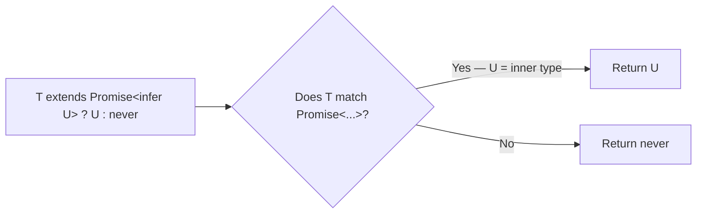

---

### 4. Code Examples

```typescript
// Built-in ReturnType — how TypeScript implements it internally
type ReturnType<T> = T extends (...args: any[]) => infer R ? R : never;

function greet(name: string): string {
    return `Hello, ${name}`;
}
type G = ReturnType<typeof greet>; // string

// Built-in Parameters — extracts tuple of parameter types
type Parameters<T> = T extends (...args: infer P) => any ? P : never;
type P = Parameters<typeof greet>; // [name: string]
```

```typescript
// Unwrap a Promise — built-in as Awaited<T> since TS 4.5
type Unwrap<T> = T extends Promise<infer U> ? U : T;
type A = Unwrap<Promise<number>>; // number
type B = Unwrap<string>; // string (no match → returns as-is)
```

```typescript
// Extract element type of an array
type ElementType<T> = T extends (infer E)[] ? E : never;
type N = ElementType<number[]>; // number
type S = ElementType<string[][]>; // string[] (one level of unwrap)
```

```typescript
// Extract constructor argument type
type ConstructorArg<T> = T extends new (arg: infer A) => any ? A : never;

class HttpClient {
    constructor(public config: { baseUrl: string; timeout: number }) {}
}
type Config = ConstructorArg<typeof HttpClient>; // { baseUrl: string; timeout: number }
```

```typescript
// Deeply unwrap nested Promises (recursive infer + conditional)
type DeepAwaited<T> = T extends Promise<infer U> ? DeepAwaited<U> : T;
type D = DeepAwaited<Promise<Promise<string>>>; // string
```

```typescript
// Extract the last element of a tuple
type Last<T extends any[]> = T extends [...any[], infer L] ? L : never;
type L = Last<[number, string, boolean]>; // boolean
```

---

### 5. Common Mistakes

| Mistake                                 | Why It's Wrong                                            | Fix                                             |
| --------------------------------------- | --------------------------------------------------------- | ----------------------------------------------- |
| Using `infer` outside conditional types | Syntax error — `infer` is only valid inside `extends ? :` | Wrap in a conditional type                      |
| Expecting `infer` to narrow at runtime  | `infer` is purely compile-time; no runtime effect         | Use `infer` for type-level transformations only |
| Infinite recursion without base case    | Recursive `infer` types need a non-matching branch        | Always include the `T` (fallthrough) branch     |

---

### 6. Interview Perspective

> Interviewers ask: _"How is `ReturnType<T>` implemented in TypeScript?"_
> **Answer:** `type ReturnType<T> = T extends (...args: any[]) => infer R ? R : never;` — It uses `infer R` inside a conditional type to capture the return type. Also: _"What is the `infer` keyword?"_ — A type variable declaration inside a conditional type's `extends` clause; TypeScript fills it in by pattern-matching the actual type against the pattern.

---

## `@ts-ignore`, `@ts-expect-error`, and `@ts-nocheck`

> [↑ Back to TOC](#table-of-contents)

### 1. Concept Explanation

TypeScript provides three escape hatches to suppress or manage type errors. They are intentionally named differently because they have subtly different semantics and intended use cases. Understanding the differences is important for writing maintainable TypeScript.

---

### 2. Why It Exists

Real-world codebases often interact with legacy code, third-party libraries with incomplete types, or highly dynamic patterns TypeScript can't infer. These directives let you acknowledge and suppress known-unavoidable errors without abandoning type checking for the whole file.

---

### 3. Comparison Table

| Directive             | What it does                                                             | When to use                                    |
| --------------------- | ------------------------------------------------------------------------ | ---------------------------------------------- |
| `// @ts-ignore`       | Suppresses the NEXT line's error unconditionally                         | Rare: third-party code you can't fix           |
| `// @ts-expect-error` | Suppresses next line's error, but **errors itself if no error is found** | Tests for expected type errors; versioned code |
| `// @ts-nocheck`      | Disables type checking for the **entire file**                           | Migrating large JS files to TS incrementally   |
| `// @ts-check`        | Enables type checking in a `.js` file                                    | Gradual JS migration without full TS setup     |

---

### 4. Code Examples

```typescript
// @ts-ignore — just suppresses, no safety net
// ⚠️ If the error is fixed, @ts-ignore silently stays and doesn't warn you
// @ts-ignore
const x: number = "this is a string"; // error suppressed

// @ts-expect-error — the BETTER choice for intentional suppression
// ✅ If the line below someday stops erroring, TypeScript will warn you
// @ts-expect-error — this assignment is intentionally wrong for test purposes
const y: number = "this is a string";
```

```typescript
// Primary use case: testing that type errors DO occur
// (common in TypeScript library tests / tsd type tests)

type Add<A extends number, B extends number> = number; // simplified

// @ts-expect-error -- Argument of type 'string' is not assignable to parameter of type 'number'
const result: Add<string, 5> = 0;
```

```typescript
// @ts-nocheck at the top of a file
// @ts-nocheck
// This entire file is now unchecked — useful when migrating a large old JS file to .ts

import legacyHelper from "./old-module"; // no errors even if untyped
legacyHelper.doStuff(42, "extra", undefined); // all passes
```

---

### 5. Common Mistakes

| Mistake                                          | Why It's Wrong                              | Fix                                                           |
| ------------------------------------------------ | ------------------------------------------- | ------------------------------------------------------------- |
| Using `@ts-ignore` instead of `@ts-expect-error` | Silently stays even if the error disappears | Prefer `@ts-expect-error` when suppressing intentional errors |
| `@ts-nocheck` in production files                | Loses all type safety for that file         | Only use during migration; remove once file is typed          |
| Over-using any of these                          | Signals a design issue in the types         | Fix the underlying type mismatch instead                      |

---

### 6. Interview Perspective

> Interviewers ask: _"What's the difference between `@ts-ignore` and `@ts-expect-error`?"_
> **Answer:** Both suppress the type error on the next line, but `@ts-expect-error` additionally **fails if no error is present** — making it self-documenting and safe to leave in code. If the error is fixed and you forget to remove `@ts-expect-error`, TypeScript will warn you. With `@ts-ignore`, stale suppressions accumulate silently.

---

### Session 9 Recap

- Type narrowing: TypeScript automatically restricts types inside `if`/`switch` based on guards
- Type guards: `typeof`, `instanceof`, `in`, and custom predicates (`x is Type`)
- `keyof T` gives a union of all keys of type `T` — essential for generic property access
- `typeof x` (in type position) extracts the TypeScript type of a variable
- Utility types (`Partial`, `Pick`, `Omit`, `Record`, etc.) are built-in mapped/conditional types
- Mapped types transform type shapes by iterating over `keyof T`
- **Template literal types** — generate string union types from combinations at compile time
- **`satisfies`** — validate a type contract without losing narrow inferred types
- **Recursive types** — type that references itself; used for JSON, trees, nested structures
- **`infer`** — captures type variables inside conditional types; powers `ReturnType`, `Parameters`, `Awaited`
- **`@ts-expect-error`** — preferred suppression directive; self-alerts if the error disappears

---

### Conceptual Questions

1. What is the difference between `typeof` in a JavaScript expression vs TypeScript's type-level `typeof`?
2. If you have a type with 10 properties and want all of them optional, would you rewrite the interface? What would you use?

### Interview Questions

1. _"What is `keyof` in TypeScript? Write a generic function that uses `keyof` to safely access a property."_
2. _"What is the difference between `Partial<T>` and `Required<T>`? How are they implemented using mapped types?"_

---

[↑ Back to TOC](#table-of-contents)

<a id="session-10"></a>

# SESSION 10 - Modules & Project Structure

---

## ES Modules in TypeScript

> [↑ Back to TOC](#table-of-contents)

### 1. Concept Explanation

TypeScript uses the JavaScript ES module system (`import`/`export`). Each file is its own module with its own scope. You explicitly control what is public with `export` and what you consume with `import`.

TypeScript adds **type-only imports** (`import type`) which are stripped at compile time entirely — they produce zero runtime JavaScript. Use `import type` for interfaces and type aliases that have no runtime representation.

---

### 2. Code Examples

```typescript
// src/types/user.ts — export types
export interface User {
    id: number;
    name: string;
    email: string;
}
export type UserId = number;
export type Role = "admin" | "user";

// src/utils/validators.ts
import type { User } from "../types/user"; // type-only — zero runtime cost

export function isValidUser(data: unknown): data is User {
    return (
        typeof data === "object" &&
        data !== null &&
        "id" in data &&
        "name" in data &&
        "email" in data
    );
}

// src/index.ts
import { UserService } from "./services/userService";
import type { User } from "./types/user"; // type-only import

// Named exports (preferred — more refactor-friendly)
export function add(a: number, b: number): number {
    return a + b;
}
export const PI = 3.14159;

// Default export (one per file)
export default class Logger {
    log(msg: string): void {
        console.log(`[LOG]: ${msg}`);
    }
}

// Importing both
import Logger, { add, PI } from "./utils";

// Re-exporting (barrel exports) — src/types/index.ts
export type { User, UserId, Role } from "./user";
// Consumers then import from "src/types" instead of "src/types/user"

// Module augmentation — extend third-party types
// src/types/express.d.ts
import "express";
declare module "express-serve-static-core" {
    interface Request {
        currentUser?: { id: number; role: string };
    }
}
// Now req.currentUser is typed in all route handlers
```

---

### 3. Recommended Project Structure

```
src/
  types/        — All interfaces and type aliases
    user.ts
    index.ts    — barrel re-exports
  services/     — Business logic
    userService.ts
  utils/        — Pure helper functions
    validators.ts
  controllers/  — HTTP route handlers
    userController.ts
  index.ts      — Entry point
```

---

### 4. Interview Perspective

Interviewers ask: _"What is the difference between `import` and `import type`?"_

Answer: `import type` is erased completely at compile time, producing no JavaScript output. It can only import types (interfaces, type aliases), not values or classes. Using `import type` for type-only imports makes your intent explicit, avoids circular dependency issues, and makes bundlers more efficient.

---

---

## Declaration Files (.d.ts)

> [↑ Back to TOC](#table-of-contents)

### 1. Concept Explanation

A **declaration file** (`.d.ts`) is a TypeScript file that contains only type information — no runtime code. It tells TypeScript what types a JavaScript library exposes, without including any of the actual JavaScript implementation. Think of it as a "type blueprint" for a plain JavaScript module.

This is exactly what the `@types/express`, `@types/node` packages are — they are collections of `.d.ts` files that describe the shape of Express and Node.js APIs so TypeScript can type-check your code when you use them.

---

### 2. Why TypeScript Needs This

The npm ecosystem has thousands of packages written in plain JavaScript, with no TypeScript types. Before you could use them type-safely, someone had to write type declarations for them. The `@types` organization on npm (maintained by the TypeScript community) provides these declarations for most popular packages. When a package is written in TypeScript natively, it ships its own `.d.ts` files alongside the compiled JS.

---

### 3. Visual Representation

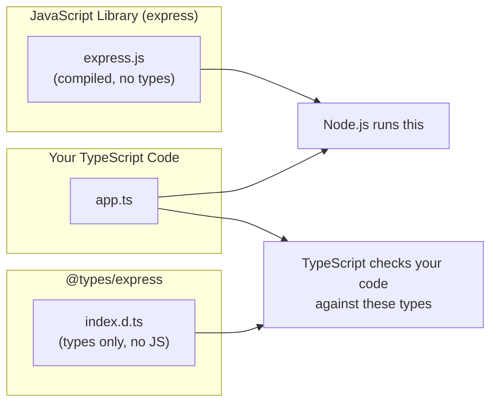

---

### 4. Code Examples

```typescript
// ===========================================
// WRITING A .d.ts FILE FOR A JS MODULE
// ===========================================

// math.js (plain JavaScript — no types)
// function add(a, b) { return a + b; }
// module.exports = { add, PI: 3.14159 };

// math.d.ts (declaration file alongside it)
export declare function add(a: number, b: number): number;
export declare const PI: number;

// Now you can use math.js with full type safety:
// import { add, PI } from "./math";
// add(1, 2);   // OK
// add("1", 2); // ERROR — TypeScript uses math.d.ts for checking

// ===========================================
// AMBIENT DECLARATIONS — declare global shapes
// ===========================================

// globals.d.ts
declare const __DEV__: boolean; // global injected by bundler (webpack/vite)
declare const APP_VERSION: string; // global injected at build time

// Use in code without import:
if (__DEV__) {
    console.log("Development mode");
}

// ===========================================
// DECLARING AN UNTYPED THIRD-PARTY MODULE
// ===========================================

// When a package has no @types and no built-in types, declare it yourself:
// src/types/some-lib.d.ts
declare module "some-untyped-library" {
    export function parseData(input: string): Record<string, unknown>;
    export interface ParseOptions {
        strict?: boolean;
        encoding?: string;
    }
    export default class Parser {
        constructor(options?: ParseOptions);
        parse(data: string): Record<string, unknown>;
    }
}

// Now TypeScript knows the shape:
// import Parser from "some-untyped-library";
// const p = new Parser({ strict: true });

// ===========================================
// EXTENDING GLOBAL TYPES
// ===========================================

// Add a property to the global Window object (browser)
declare global {
    interface Window {
        analytics: {
            track(event: string, data?: Record<string, unknown>): void;
        };
    }
}

// Now this is type-safe:
// window.analytics.track("page_view", { url: "/home" });

// ===========================================
// HOW @types PACKAGES WORK
// ===========================================

// When you run: npm install -D @types/express
// You get: node_modules/@types/express/index.d.ts
// That file contains all the type declarations for Express.
// The actual express package (JS) is separate.

// TypeScript finds @types automatically when you install them.
// The lookup order: local .d.ts files → @types/* → built-in lib

// You can also point to a custom types folder in tsconfig:
// {
//   "compilerOptions": {
//     "typeRoots": ["./src/types", "./node_modules/@types"]
//   }
// }
```

---

### 5. Common Mistakes

A very common mistake is installing a package like `express` and wondering why TypeScript has no type info — forgetting that `@types/express` must be installed separately. Use `npm install -D @types/packagename` for any untyped package.

Another mistake is writing `.d.ts` files with actual implementation code. Declaration files must only contain `declare` statements and type definitions — no executable code. If you accidentally put logic in a `.d.ts` file, TypeScript will error.

---

### 6. Interview Perspective

_"What is a `.d.ts` file in TypeScript? Why do packages like Express have a separate `@types/express`?"_

Answer: A `.d.ts` file is a type declaration file — it describes the shape of a JavaScript module in TypeScript's type system without containing any runtime code. Express is written in JavaScript with no built-in types. The TypeScript community maintains `@types/express` (in the DefinitelyTyped repository) which provides the type declarations. Modern packages written in TypeScript (like `zod`, `prisma`) ship their own `.d.ts` files and don't need a separate `@types` package.

_"How would you add types for a JavaScript library that has no @types package?"_

Answer: Create a `.d.ts` file (e.g., `src/types/my-lib.d.ts`) with `declare module "my-lib" { ... }` containing the type signatures for the functions and classes you use.

---

### Session 10 Recap

- TypeScript uses ES module syntax (`import`/`export`)
- `import type` is type-only — zero runtime output; use it for interfaces and type aliases
- Barrel files (`index.ts` with re-exports) create clean import paths
- Module augmentation (`declare module "..."`) lets you extend third-party library types
- Named exports are preferred over default exports for better refactoring support
- **Declaration files (`.d.ts`)** — type blueprints for JS modules; what `@types/*` packages are
- **Ambient declarations** — `declare const`, `declare module`, `declare global` for global shapes

---

### Conceptual Questions

1. What would happen at runtime if you used `import type { User }` and tried to use `User` as a value (e.g., `new User()`)?
2. Why are barrel files useful? What is the downside of overusing them?

### Interview Questions

1. _"What is `import type` in TypeScript and why would you use it over a regular import?"_
2. _"How would you extend the Express `Request` type to include a `currentUser` property?"_

---

[↑ Back to TOC](#table-of-contents)

<a id="session-11"></a>

# SESSION 11 - TypeScript with Node.js / Express

---

## Full Setup

> [↑ Back to TOC](#table-of-contents)

### 1. Installation

```bash
npm init -y
npm install express
npm install -D typescript ts-node nodemon @types/node @types/express
npx tsc --init
```

**`tsconfig.json`:**

```json
{
    "compilerOptions": {
        "target": "ES2020",
        "module": "commonjs",
        "strict": true,
        "esModuleInterop": true,
        "outDir": "./dist",
        "rootDir": "./src",
        "resolveJsonModule": true,
        "skipLibCheck": true
    },
    "include": ["src/**/*"]
}
```

**`package.json` scripts:**

```json
{
    "scripts": {
        "dev": "nodemon --exec ts-node src/index.ts",
        "build": "tsc",
        "start": "node dist/index.js"
    }
}
```

---

### 2. Building a Typed REST API

```typescript
// src/types/user.ts
export interface User {
    id: number;
    name: string;
    email: string;
}
export interface CreateUserDto {
    name: string;
    email: string;
}
export type UpdateUserDto = Partial<CreateUserDto>;
```

```typescript
// src/index.ts
import express, { Request, Response, NextFunction } from "express";
import type { User, CreateUserDto, UpdateUserDto } from "./types/user";

const app = express();
app.use(express.json());

const users: User[] = [
    { id: 1, name: "Alice", email: "alice@example.com" },
    { id: 2, name: "Bob", email: "bob@example.com" },
];

// GET /users
app.get("/users", (_req: Request, res: Response<User[]>) => {
    res.json(users);
});

// GET /users/:id  — Request<Params, ResBody, ReqBody, Query>
app.get(
    "/users/:id",
    (req: Request<{ id: string }>, res: Response<User | { error: string }>) => {
        const user = users.find((u) => u.id === Number(req.params.id));
        if (!user) return res.status(404).json({ error: "User not found" });
        res.json(user);
    },
);

// POST /users — typed request body
app.post(
    "/users",
    (req: Request<{}, {}, CreateUserDto>, res: Response<User>) => {
        const { name, email } = req.body; // TypeScript knows the shape
        const newUser: User = { id: Date.now(), name, email };
        users.push(newUser);
        res.status(201).json(newUser);
    },
);

// PATCH /users/:id
app.patch(
    "/users/:id",
    (req: Request<{ id: string }, {}, UpdateUserDto>, res: Response) => {
        const index = users.findIndex((u) => u.id === Number(req.params.id));
        if (index === -1) return res.status(404).json({ error: "Not found" });
        users[index] = { ...users[index], ...req.body };
        res.json(users[index]);
    },
);

// DELETE /users/:id
app.delete("/users/:id", (req: Request<{ id: string }>, res: Response) => {
    const index = users.findIndex((u) => u.id === Number(req.params.id));
    if (index === -1) return res.status(404).json({ error: "Not found" });
    users.splice(index, 1);
    res.status(204).send();
});

// Error middleware — MUST have all 4 params for Express to recognize it
app.use((err: Error, _req: Request, res: Response, _next: NextFunction) => {
    console.error(err.stack);
    res.status(500).json({ error: err.message });
});

app.listen(3000, () => console.log("Server running on http://localhost:3000"));
```

---

### 3. Typed Async Error Handling

```typescript
// Result type — models success or failure without scattered try/catch
type Result<T, E = Error> =
    | { success: true; data: T }
    | { success: false; error: E };

async function tryCatch<T>(fn: () => Promise<T>): Promise<Result<T>> {
    try {
        return { success: true, data: await fn() };
    } catch (e) {
        return {
            success: false,
            error: e instanceof Error ? e : new Error(String(e)),
        };
    }
}

// Using it in a route
app.get("/data", async (_req: Request, res: Response) => {
    const result = await tryCatch(() => fetchDataFromDb());
    if (!result.success) {
        return res.status(500).json({ error: result.error.message });
    }
    res.json(result.data);
});
```

---

### 4. Typed Environment Variables

```typescript
// src/config.ts
function getEnvVar(key: string): string {
    const value = process.env[key];
    if (!value) throw new Error(`Missing environment variable: ${key}`);
    return value;
}

const config = {
    port: Number(process.env.PORT ?? 3000),
    dbUrl: getEnvVar("DATABASE_URL"),
    jwtSecret: getEnvVar("JWT_SECRET"),
    nodeEnv: (process.env.NODE_ENV ?? "development") as
        | "development"
        | "production"
        | "test",
} as const;

export default config;
```

---

### 5. Interview Perspective

For Node.js/Express TypeScript interviews you will be asked to:

1. **Write a typed Express route handler** — Know `Request<Params, ResBody, ReqBody, Query>` syntax
2. **Explain `@types` packages** — Separate type-definition packages for JavaScript libraries. `@types/express` provides types for the already-compiled `express` package.
3. **Handle async errors in Express** — The `(err: Error, req, res, next)` handler MUST have all 4 parameters to be recognized as an error handler by Express.
4. **Type environment variables** — `process.env.X` returns `string | undefined`, not `string`. Always validate at startup.

---

### Session 11 Recap

- Install `@types/express` for Express type definitions
- `Request<Params, ResBody, ReqBody, Query>` — use generics to type each part of a request
- Always type request bodies using interfaces (`CreateUserDto`, `UpdateUserDto`)
- Error middleware requires all 4 parameters: `(err, req, res, next)`
- Use the `Result<T>` pattern for clean async error handling
- Validate environment variables at startup — never assume `process.env.X` is defined

---

### Conceptual Questions

1. What is the `@types/express` package and why is it a `devDependency`?
2. Why must an Express error handler have exactly 4 parameters? What happens if you omit `next`?

### Interview Questions

1. _"How would you type an Express route that accepts a JSON body for creating a user and returns the created user?"_
2. _"What is the `Result<T>` pattern and why is it preferred over try/catch in some cases?"_

---

---

# Quick Reference Cheat Sheet

---

## When to Use What

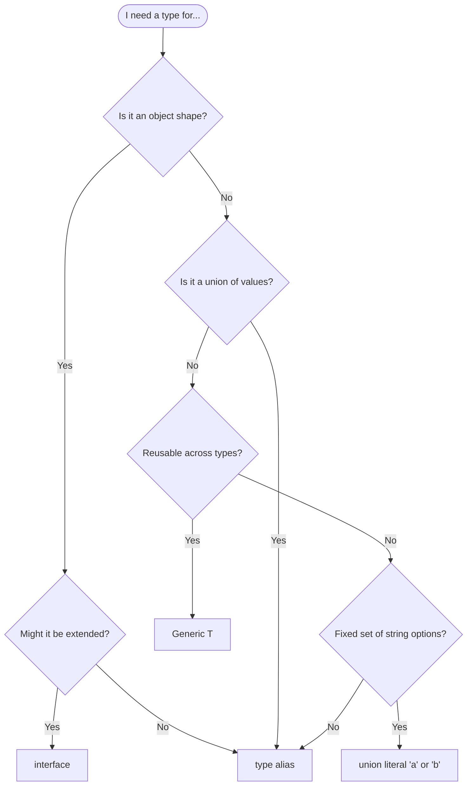

---

## Master Cheat Table

| Situation                      | Solution                                  |
| ------------------------------ | ----------------------------------------- |
| Object with named properties   | `interface` or `type`                     |
| Value can be A or B            | Union `A \| B`                            |
| Value must be both A and B     | Intersection `A & B`                      |
| Fixed known string values      | Literal union `"GET" \| "POST"`           |
| Function works with many types | Generic `<T>`                             |
| All properties optional        | `Partial<T>`                              |
| All properties required        | `Required<T>`                             |
| All properties readonly        | `Readonly<T>`                             |
| Select some properties         | `Pick<T, "a" \| "b">`                     |
| Remove some properties         | `Omit<T, "id">`                           |
| Map keys to values             | `Record<K, V>`                            |
| Remove from union              | `Exclude<T, U>`                           |
| Keep matching from union       | `Extract<T, U>`                           |
| Remove null/undefined          | `NonNullable<T>`                          |
| Get function return type       | `ReturnType<typeof fn>`                   |
| Get function param types       | `Parameters<typeof fn>`                   |
| Unwrap Promise type            | `Awaited<Promise<T>>`                     |
| Check type at runtime          | Type guard (`typeof`, `instanceof`, `in`) |
| Type from existing variable    | `typeof myVar` (type context)             |
| Keys of an object type         | `keyof T`                                 |
| Avoid `any` for unknowns       | `unknown` + type guard                    |

---

## Session Summary

| Session | Key Takeaway                                                                                                                                    |
| ------- | ----------------------------------------------------------------------------------------------------------------------------------------------- |
| 1       | TS = JS + static types; compiles away; bugs at compile time not runtime                                                                         |
| 2       | Primitives lowercase; `unknown` not `any`; arrays vs tuples; **type assertions** (`as`, `!`)                                                    |
| 3       | Inference is smart but annotate params; `const` keeps literal types                                                                             |
| 4       | `interface` = contract; `?` optional; `readonly` ≠ deep immutable                                                                               |
| 5       | Union/Intersection/Literal types; **Enums**; **structural typing**; **Branded types** (phantom brand)                                           |
| 6       | Typed params + return; optional/default/rest; overloads for multiple signatures                                                                 |
| 7       | Generics = type-safe `any`; `<T extends X>` = constraint; `keyof` = key union                                                                   |
| 8       | `public/private/protected`; params shorthand; abstract class vs interface; **Decorators**                                                       |
| 9       | Type guards; utility/mapped/conditional types; **Template literals**; **`satisfies`**; **Recursive types**; **`infer`**; **`@ts-expect-error`** |
| 10      | `import type` = zero runtime; barrel exports; module augmentation; **`.d.ts` files**                                                            |
| 11      | `Request<P,R,B,Q>` for Express; `Result<T>` pattern; validate env vars                                                                          |

---

> **Recommended study order:**
> Session 1 → 2 → 3 → 4 → **7 (Generics first!)** → 5 → 6 → 8 → 9 → 10 → 11
>
> Learn Generics before Advanced Types because Utility Types (Session 9) are all built with Generics.
